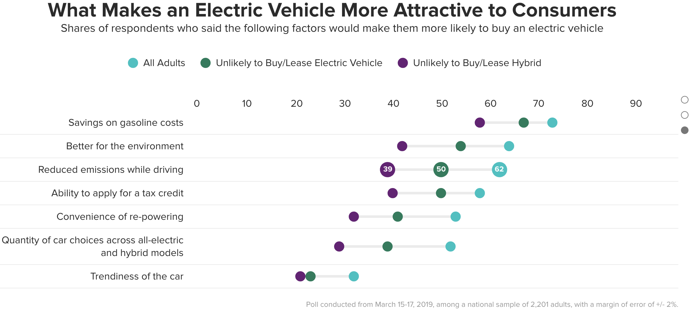
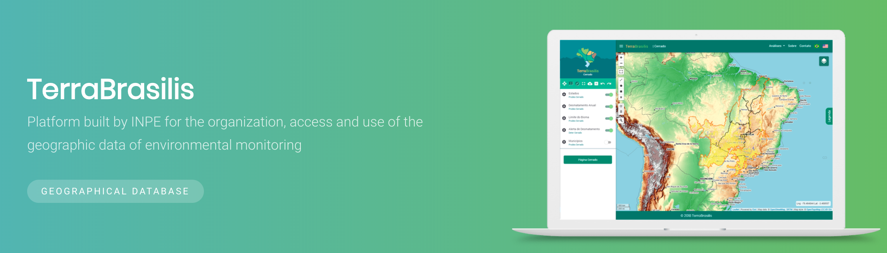
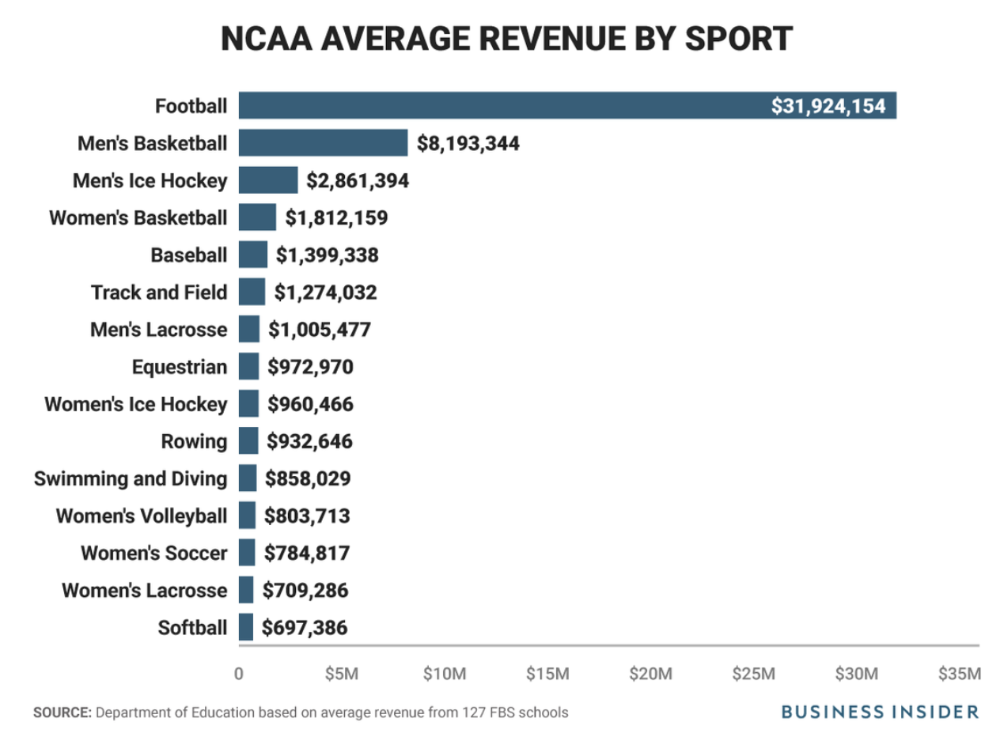
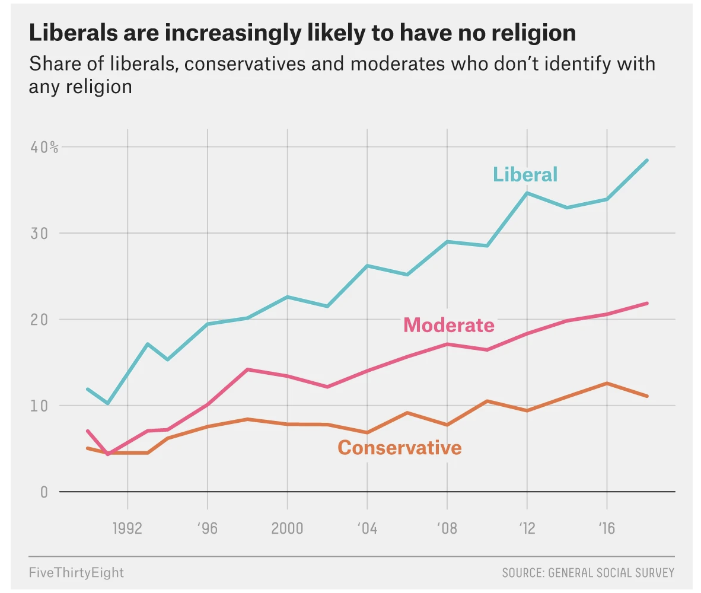
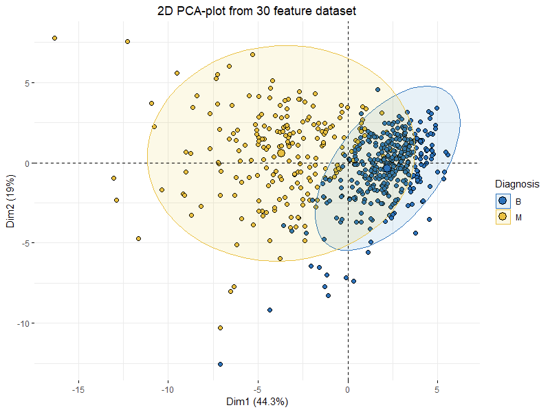

We deliver a collection of timely, relevant, and curious topics across a broad landscape of interests. Join us, give us your feedback and sign up for our free weekly newsletter designed to nurture, expand, and engage the diverse world of data science. 

 [Email us to receive our slides from Predictive Analytics World](mailto:consultation_request@paradigmdata.io). The slides outline a framework to build an analytic mindset, including real-world examples from companies like Lyft and Citrix. Please [reach out](mailto:consultation_request@paradigmdata.io) to us with feedback or to meet with us for a free consultation about how we can help train your teams in data science. 

We've also published an ebook for getting started in RStudio, Git, and Github. Check it out[ here](https://leanpub.com/showingyourwork/).

* * *

## Tech >

### The gap in EV adoption is largely around education 

With only 1.2% of U.S. car sales made up by electric vehicles and 50% more adults reporting that they would be very or somewhat likely to buy or lease a hybrid car compared with an all-electric car, the growth in the electric vehicle market has a big gap to fill. Education and infrastructure are the two leading areas of opportunity according to a recent [poll](https://morningconsult.com/wp-content/uploads/2019/05/190335_crosstabs_ELECTRIC_VEHICLES_Adults_v1_ML-6.pdf) by [Morning Consult](https://morningconsult.com/). Despite 20 states offering financial incentives for electric car purchases 84% of adults did not know if these state-specific incentives for buyers existed where they live. Access to charging sources for electric vehicles is uneven with many consumers not having a garage and public stations being sparse. California has 20,285 public EV chargers compared with the next highest state of Texas with only 3,117 for a gap of over 6X. Consumers are motivated by the personal financial benefits of gasoline and tax credits alongside improving the environment. Engaging buyers is changing as well. Over 50% of adults aged 18 - 44 were willing to buy a car online if it were offered at a lower price exclusively for online buyers. With a current premium of $12,000 on average to produce an all-electric vehicle, adoption will require greater awareness around the financial and operational resources available.     

source: [For Widespread Adoption of Electric Vehicles, Many Roadblocks Ahead](https://morningconsult.com/2019/05/22/for-widespread-adoption-of-electric-vehicles-many-roadblocks-ahead/) 

# *Neural networks may enable exploratoration of the development of an artists style*

Paintings can contain layers, not only layers of oil but the hidden layers of development resulting in the image that we the viewer sees before them today. Anthony Bourached and George Cann at University College London are the first to have retrieved a lost Picasso painting in color using a technique developed at the University of Tubingen in 2015 call neural transfer style. This novel approach leverages the way neural networks analyze data in layers that are able to become more specific.

*Neural networks consist of layers that analyze an image at different scales. The first layer might recognize broad features like edges, the next layer sees how these edges form simple shapes like circles, the next layer recognizes patterns of shapes, such as two circles close together, and yet another layer might label these pairs of circles as eyes.**  ** *

X-rays have been used in the past to reveal previous works painted since painted over, however, they have been unable to capture color creations. The ability to potentially distinguish the style of an artist through features in a painting such as the eyes of the subject may offer a curious approach to classify unknown works.    

source: [This Picasso painting had never been seen before. Until a neural network painted it.](https://www.technologyreview.com/s/614333/this-picasso-painting-had-never-been-seen-before-until-a-neural-network-painted-it/) 

## Health & Medicine >

# *Self-defense training can enable women to cope with threat of sexual violence*

*My body refused to cooperate, and there was a split. My mind left my body and I was looking at my body from the outside, like in a nightmare, she says. Without this split, I wouldn’t have found the power to react.*

Celine Sabag was the victim of sexual violence and has achieved therapeutic benefits and personal empowerment from the exposure like therapy offered by self-defense training focused on the victims of trauma. Sleeplessness, nausea and flashbacks were all struggles Sabag suffered. Trauma victims often use dissociation as a coping mechanism but experts recommend treatments that use a *window of tolerance*. That is, engage patients within their threshold of emotional stimulation where they can avoid dissociation and process the experience. IMPACT is a self-defense training program designed specifically for women and the potential for a known attacker which is common among victims of sexual violence. When a victim has a relationship with their attacker the dynamic is very different and IMPACT is designed to prepare women with the ability to manage those emotions and overcome the fear of being raped.

source: [After Sexual Assault, Some Survivors Seek Healing in Self-Defense](https://undark.org/article/self-defense-classes-assault-ptsd/) 

* * *

## Science >

### TerraBrasilis is an interactive map to visualize satellite imagery to track clear-cutting in [the country’s Amazon basin](http://mail01.tinyletterapp.com/data-is-plural/data-is-plural-2019-09-18-edition/15248850-en.wikipedia.org/wiki/amaz-c3-b4nia_legal?c=d8ac1397-ade2-44c3-8297-870124eb4f89)

Satellite imagery is used in Brazil to measure deforestation of the Amazon and inform public policy. Since 1988 this data has been collected by [PRODES](http://www.obt.inpe.br/OBT/assuntos/programas/amazonia/prodes). The measurements have demonstrated accuracy at close to 95% and can be explored visually using  [TerraBrasilis](http://terrabrasilis.dpi.inpe.br/app/map/deforestation?hl=en-us). The GUI tool allows the user to select a number of data points including deforestation, Amazon biome and forest. 

source: [TerraBrasilis web portal ](http://terrabrasilis.dpi.inpe.br/app/map/deforestation?hl=en-us) 

* * *

## Money >

### Colleges should pay collegiate athletes

Universities with a Division 1 (D1) athletic program make significant amounts of money from their student-athletes. Traditionally, schools compensate student-athletes via their scholarship (i.e., they play a sport in exchange for an education). However, economists Allen Sanderson and John Siegfried revealed think this situation has created an inherently unfair and rigged system. In the current situation, university coaches and administrators control the market and typically end up making their money on the labor "families that are economically challenged." 

* "The income transfer doesn’t seem to be going in the same direction as income transfers we engineer through the government in general."*

How is this allowed to happen? Well, back in 1950 there was a man named Ray Dennison playing football at Fort Lewis College in Durango, Colorado. He suffered a fatal head injury during a game, and his wife filed a lawsuit against the college to receive death benefits. The NCAA and courts turned the case down, famously stating that a university "was not in the football business."

*"In fact, the state-conducted institution, supported by taxpayers, could not as a matter of business enter into the maintenance of a football team for the purpose of making a profit directly or indirectly out of the taxpayers’ money,"*

That sounds crazy, given how popular college football is today. But this leads to another surprising point that came up in the interview: not many D1 athletic programs turn a profit. Pretty wild, huh? Check out the graph below from [this Business Insider article in 2017](https://www.businessinsider.com/college-sports-football-revenue-2017-10).

 

Football is leading the pack in terms of revenue, but apparently, very few college football programs make money. Where does all the money go? Well, according to the interview, most of that money goes to coaches, 

*	"In many states, it’s a college basketball or football coach who is the highest-paid public employee…*

*"Yeah, 45 out of the 50 states."*

What would happen if we changed things? Sanderson and Siegfried explain the pros and cons of paying athletes a salary for their skills. For example, what if an athlete is making more than a professor or coach? And how would paying athletes affect athletic departments as a whole? Would less popular sports be able to survive in a free market? This was a great article and interview with lots of surprises. 

*source*: [https://www.aeaweb.org/research/case-to-pay-student-athletes-sanderson-siegfried-interview](https://www.aeaweb.org/research/case-to-pay-student-athletes-sanderson-siegfried-interview) 

## * * *

## Media & Politics >

### Liberals in America have been leaving religion for some time now

[Amelia Thomson-DeVeaux](https://fivethirtyeight.com/contributors/amelia-thomson-deveaux/) and [Daniel Cox](https://fivethirtyeight.com/contributors/daniel-cox/) over at FiveThirtyEight wrote a great breakdown of how [Americans who are religiously unaffiliated differ across the two political parties](https://fivethirtyeight.com/features/the-christian-right-is-helping-drive-liberals-away-from-religion/). According to the 2018 General Social Survey, Liberals are less likely to identify with any particular religion, a trend that has been happening since the 2000s.

However, the article also points out the reason for the shift might be due to how closely intertwined political and religious beliefs have become for Americans. 

*"most people's political ideology is more tightly tethered to their religious identity. The overlap is far from complete — there are still some secular conservatives and even more religious liberals..."*

The second point is worth noting because as secular as democrats might claim to be in the privacy of a survey, not a single democratic politician is running on a non-religious platform. Many Democratic candidates [have embraced faith in their campaigns](https://www.apnews.com/9de001e6bb7843618ab42fc3ee674584). However, we know that religiosity is not binary, but rather it tends to exist on a continuum. On the lower end, you might tacitly wear a cross or go to church on the holidays because you don't want to upset your grandparents. On the higher end, you might be bombarding social media platforms with scripture and handing out pamphlets. It turns out how much a person adheres to a particular political ideology can predict how likely they are to be religious (and vice-versa). 

*"...the more liberal you are, the less likely you are to belong to a faith; whereas if you're conservative, you're more likely to say you're religious"*

The reason? Social scientists have shown the shift is due to the Christian right's involvement in Republican politics. According to recent research from the University of Pennsylvania political science professor [Michele Margolis](https://www.sas.upenn.edu/polisci/people/standing-faculty/michele-margolis), 

*"it wasn't that people were generally becoming more secular, and then gravitating toward liberal politics because it fit with their new religious identity. People's political identities remained constant as their religious affiliation shifted."*

The loss of religious affiliation might post a bit of a strategic problem for Democratic candidates and political initiatives. Religion has always been a great way to unify people under a common set of beliefs, customs, and language. Secular candidates might find it harder to find broad appeal for their worldview if they're seen as unrelatable. 

source: [https://fivethirtyeight.com/features/the-christian-right-is-helping-drive-liberals-away-from-religion/](https://fivethirtyeight.com/features/the-christian-right-is-helping-drive-liberals-away-from-religion/)

* * *

## R-roundup >

### Visualize functions in the tidyverse

* Animations of tidyverse verbs using R, the tidyverse, and gganimate! Explore relational joins with animated visualizations in this excellent tutorial.

**Source: ****[Animations of tidyverse languag**e](https://github.com/gadenbuie/tidyexplain)

### Principal Component Analysis in R

* Principal component analysis is a helpful technique for understanding how groups of variables, or components, help to explain an outcome. Building and visualizing your components is a powerful tool for both predictability and explainability. 

**Source:  ****[Principal Component Analysis (PCA) 101, using **R](https://towardsdatascience.com/principal-component-analysis-pca-101-using-r-361f4c53a9ff) 

### The Tuber package lets R users pull in YouTube data including views, likes and dislikes

* Accessing YouTube’s metadata such as views, likes, dislikes and comments is simple in R thanks to the [tuber](https://soodoku.github.io/tuber/articles/tuber-ex.html) package by [Gaurav Sood](https://www.gsood.com/).

**_Source: _****_[How to download YouTube data in R using "tuber" and “purrr_**”](http://www.storybench.org/how-to-download-youtube-data-in-r-using-tuber-and-purrr/) 

### Hadley Wickham: Managing many models with R

* Watch the master Hadley Wickham connect concepts with packages including: 

    * Nested data (tidyr)

    * Functional programming (purrr)

    * Models -> Tidy data (broom)

**Source: ****[Hadley Wickham: Managing many models with **R](https://www.youtube.com/watch?v=rz3_FDVt9eg&list=WL&index=9&t=0s)

Follow us

[@datasartoriasf](https://twitter.com/datasartoriasf)

[@mjfrigaard ](https://twitter.com/mjfrigaard)

[Peter Spangler](https://www.storybench.org/author/spangler/)

[Martin Frigaard](http://www.storybench.org/author/martinfri/)

[Paradigm Data Group](https://www.paradigmdata.io/)

