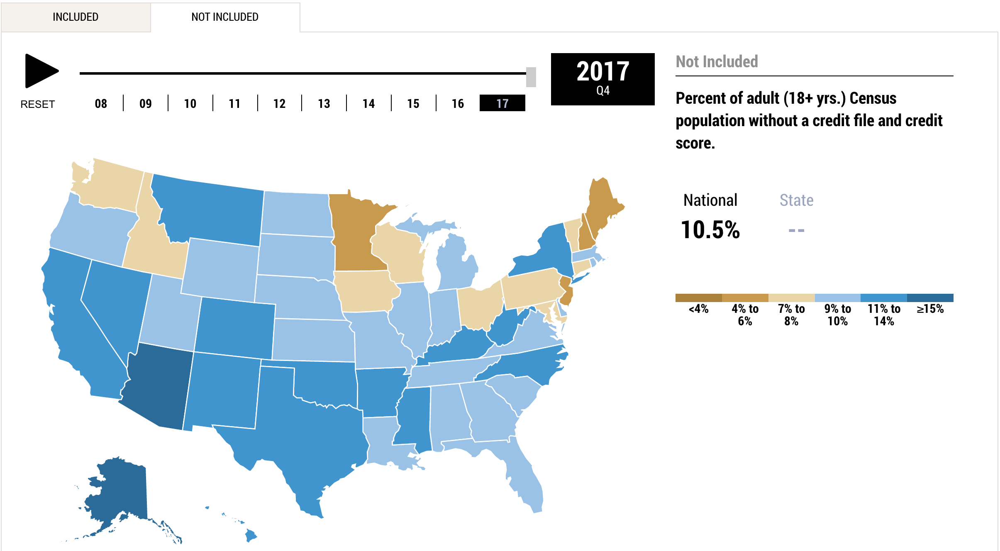
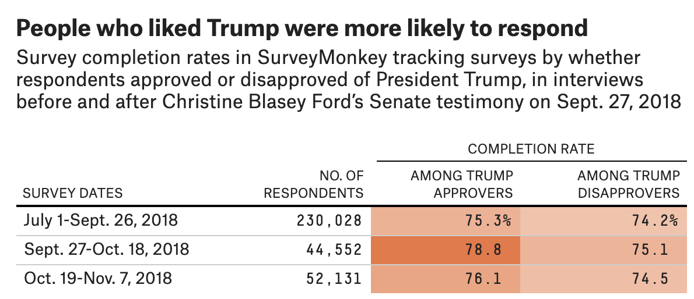
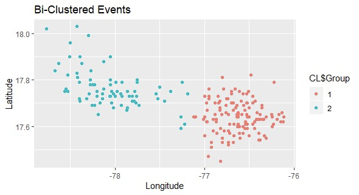

We deliver a collection of timely, relevant, and curious topics across a broad landscape of interests. Join us, give us your feedback and sign up for our free weekly newsletter designed to nurture, expand, and engage the diverse world of data science. 

 [Email us to receive our slides from Predictive Analytics World](mailto:consultation_request@paradigmdata.io). The slides outline a framework to build an analytic mindset, including real-world examples from companies like Lyft and Citrix. Please [reach out](mailto:consultation_request@paradigmdata.io) to us with feedback or to meet with us for a free consultation about how we can help train your teams in data science. 

We've also published an ebook for getting started in RStudio, Git, and Github. Check it out[ here](https://leanpub.com/showingyourwork/).

* * *

## Tech >

### Predicting Earthquake Activity with AI

Residents of the Northwest may have a head start on preparing for earthquakes in the future. A study by geophysicist [Paul Johnson](https://public.lanl.gov/geophysics/geophysics/staff/johnson/johnson.shtml) that has since been reproduced by researchers in Europe show that he and his team successfully predicted earthquake activity using machine learning. The *slow slip *type of quakes are not felt like the faster types and occur around once per year in the Northwest but are powerful enough to result pushing Vancouver Island a centimeter closer to the Pacific Ocean. 

Johnson’s team trained a random forest model using the audio data collected from laboratory experiments that simulated the physical phenomena of plate movements. The data produced over 80 features which a random forest model can describe with relative ease of interpretability as important to explaining the earthquake signals. Due to the tremendous amount of data collected on slow slip earthquakes Johnson’s team had a catalog of real world data to train on following laboratory audio phase. This data identified seismic energy has the greatest predictor which is itself related to the audio data Johnson had collected in his lab. This model is a small step in the world of earthquake prediction but it opens the field to a new technique yet to be largely adopted now shown useful.  

source: [Artificial Intelligence Takes On Earthquake Prediction](https://www.quantamagazine.org/artificial-intelligence-takes-on-earthquake-prediction-20190919/) 

# *[Privacy and device based data collection in the age of consen*t](https://www.bloomberg.com/news/videos/2019-08-13/say-what-facebook-paid-contractors-to-transcribe-user-audio-video)

Sara Frier of Bloomberg [reported Facebook is paying contractors to transcribe user audio](https://www.bloomberg.com/news/articles/2019-08-13/facebook-paid-hundreds-of-contractors-to-transcribe-users-audio) at a time when the company just agreed to pay a $5B fine for misusing customer data. Users have long suspected the social media company with over [1.56B users](https://www.businessinsider.com/facebook-grew-monthly-average-users-in-q1-2019-4) -- but still refers to itself as a *community* -- has been snooping in on conversations via the microphone of smartphones. One such case reported on [NBC news]( https://www.nbc4i.com/news/spying-secrets-is-facebook-eavesdropping-on-your-phone-conversations/) demonstrated a professor speaking on her phone about a safari and within 1 minute her Facebook feed led with a safari story. As far back as 2014 Facebook has been deploying features focused on capturing the audio around its users. The 2014 feature [announced by Facebook](https://newsroom.fb.com/news/2014/05/a-new-optional-way-to-share-and-discover-music-tv-and-movies/) was capable of identifying music and television using the microphone on the user’s phone. The volume and dimensions of data Facebook captures already has made it one of the most important advertising channels in the world due to its ability to serve relevant ads. Does it truly need audio data to inform the advertising engine or is there something else it is attempting to accomplish? Regardless of the goal, the mechanisms of data collection are growing without a corresponding growth in transparency or consent. There has been a more vocal conversations about the value of explicit consent in our relationships, but that should carry over to our devices as well.     

source: [Facebook has been collecting audio from some voice chats on Messenger and paying contractors to listen to and transcribe it](https://www.businessinsider.com/facebook-collects-listens-transcribes-some-messenger-voice-chats-2019-8) 

## Health & Medicine >

# *The Australian Medical Association is Attacking Accelerating Obesity*

An 18% increase in overweight and obese adults in Australia has led to a National Obesity Strategy that includes taxing sugar sweetened beverages, requiring foods to be health rated and regulation on junk food advertising. Similar [regulatory solutions](https://www.latimes.com/business/la-fi-lazarus-20141209-column.html) have been supported by leading researchers in the area of obesity and sugar including pediatric endocrinologist [Dr. Robert Lustig](https://www.linkedin.com/in/robert-lustig-8904245/). The City of Berkeley implemented a 1% tax on sugar sweetened beverages where market based regulation has resulted in a food supply where 74% of foods contain added sugar. Beyond health the Australian government is motivated by maintaining a healthy workforce among its 12.4 adults and preventing an overwhelming strain on its hospital system. Population specific data show that men are more likely to be overweight or obese compared with women at 52% versus nearly 40% among women. Sedentaryness may also play a role where only 1.9% of 15-to-17 year olds met the national guidelines for physical activity. What is often perceived to be an American diet and lifestyle of inactivity appears to be growing in adoption across cultures. In Australia the framing of the problem appears more focused on collective impact compared with individual liberty, and urgency is high. The Australian Obesity Coalition may be an interesting experiment to understand how other countries might combat this epidemic.	

source: [Almost half young adults now overweight or obese, new ABS data shows](https://www.smh.com.au/politics/federal/almost-half-young-adults-now-overweight-or-obese-new-abs-data-shows-20190930-p52w8i.html) 

* * *

## Science >

### Bad Science Makes for Bad Government

The application of research findings in the form of confident recommendations first must survive the interrogation of skepticism. Interpretation of research methodologies and results by credentialed scientists directly materialized into public policy is not enough says [Louis Anthony Cox](https://regulatorystudies.columbian.gwu.edu/tony-cox), Chair of the Environmental Protection Agency’s Clean Air Scientific Advisory Board Committee., 

*They don’t properly define key terms, such as causal relationship. They rely on research that doesn’t formulate predictive, falsifiable hypotheses. They use arbitrary methods to select which scientific literature will provide the "weight of evidence." They don’t require that research use publicly accessible, independently reproducible data and algorithms. *

He contends that this absence of reproducibility has placed too much discretion in the hands of experts and has led to recommendations that are irresponsible. For example, the absence of a focus on transparency resulted in a recommendation to the California Air Resources Board made by a staff member who falsely claimed to have a UC Davis Ph.D.. Cox suggests an interdisciplinary approach to reduce groupthink and increase standardization where multiple domains of experts can communicate in a shared analytic framework. Government agencies would benefit my having a shared methodology and ability to engage with research and conversations. Businesses have adopted a similar approach in some cases so that learnings from data in one area of the organization can be fed back into others that are positioned to benefit. As we build a larger evidence based culture it is important that we can all speak the same language to make change.     

source: [Bad Science Makes for Bad Government](https://americanmind.org/discourse/bad-science-makes-for-bad-government/) 

* * *

## Money >

### Introducing the Credit Insecurity index

On September 24, 2019 the Federal Reserve Bank of New York released a new tool in evaluating the economy called the Credit Security Index. The reports generated include [Unequal Access to Credit: The Hidden Impact of Credit Constraints](https://www.newyorkfed.org/outreach-and-education/community-development/unequal-access-to-credit-hidden-impact-credit-constraints) to inform policy makers about the access to credit based on communities. These communities could have a blemished credit file or no credit file whatsoever. The ability to access and use of credit effectively is fundamental to the ability to build wealth and is distributed across locations differently. [Credit inclusion](https://www.newyorkfed.org/data-and-statistics/data-visualization/community-credit-profiles/index.html#inclusion/credit_participation/Pct_Pop_NOT_in_CE) is the percentage of adults with a credit file and credit score and this can be as little as only 85% by state. Location based assessment helps to target areas of the greatest constraint to target those at the greatest risk. In order to build effective and impactful programs subpopulation analysis is required and location provides a level of homogeneity for both targeting and shared challenges. Initial findings show that rural communities are more likely to be credit-insecure and to be non-white. This appears to be a strong analytical framework to impact credit and wealth for at risk communities. 

*source*: [New York Fed Releases New Tool Showing More Than 12 Million U.S. Adults Live in "Credit-Insecure" Counties](https://www.newyorkfed.org/newsevents/news/regional_outreach/2019/20190924) 

## * * *

## Media & Politics >

### The art of polling and validation

The phenomena of *differential nonresponse bias *takes place when partisans on one side of a political question respond at different rates than those on the other side of the aisle. The result can create an error as the weighting of one group is uneven. In a 2018 poll following sexual assault accusations of Brett Kavanaugh survey completion rates increased 3 absolute percentage points among Trump approvers compared with disapprovers. The percentage of Republicans, conservatives, non-college educated women and rural respondents all increased. This influenced Trump’s approval rating as an artifact of the response rate. It is a critical component of all measurement that the conditions and sources of data are consistent, particularly when time is a component. When evaluating polls where it is best to be cautious of dramatic change. For more check out [Nate Silver's recent advice on polling. ](https://fivethirtyeight.com/features/how-to-handle-an-outlier-poll/)

source: [https://fivethirtyeight.com/features/the-christian-right-is-helping-drive-liberals-away-from-religion/](https://fivethirtyeight.com/features/the-christian-right-is-helping-drive-liberals-away-from-religion/)

* * *

## R-roundup >

### How to Apply a Clustering Technique to a Problem Statement 

* Applying analytics solutions to business problems requires an understanding of the problem statement and operational information. AJ Gabriel translates the context of an applied cluster solution to military deployments. 

* 

**Source: ****[Modelling Efficient Military Deployments with Machine Learning — K-Means Clustering in **R](https://towardsdatascience.com/modelling-efficient-military-deployments-with-machine-learning-k-means-clustering-in-r-7dc4ab6a945c)

### The release of tidyr 1.0! 

* [Tidyr](https://tidyr.tidyverse.org/index.html) is a package for tidying up messy datasets. [Version 1.0 ](https://www.tidyverse.org/articles/2019/09/tidyr-1-0-0/)has a lot of neat tricks for restructuring data (including some interesting ways of dealing with nested lists).

<blockquote class="twitter-tweet">
🤖 `tidyr::hoist()` robot-arm edition… data %&gt;% hoist(info,  name = &quot;name&quot;,  firstborn = list(&quot;children&quot;, 1L) ) * the latter portion aptly named &quot;the rumplestiltskin&quot; by <a href="https://twitter.com/hadleywickham?ref_src=twsrc%5Etfw">@hadleywickham</a> docs: <a href="https://t.co/Es91thelAX">https://t.co/Es91thelAX</a> gist: <a href="https://t.co/Ho5IRPoNQy">https://t.co/Ho5IRPoNQy</a> <a href="https://twitter.com/hashtag/rstats?src=hash&amp;ref_src=twsrc%5Etfw">#rstats</a> <a href="https://t.co/vrG8simf9z">pic.twitter.com/vrG8simf9z</a>
&mdash; Mara Averick (@dataandme) <a href="https://twitter.com/dataandme/status/1178716655943327745?ref_src=twsrc%5Etfw">September 30, 2019</a></blockquote>  

[Source:  tidyr 1.0.0](https://www.tidyverse.org/articles/2019/09/tidyr-1-0-0/)

### Forecasting in R with fable!

* Forecasting in the tidyverse just got way better with the [fable package](https://robjhyndman.com/hyndsight/fable/) by Rob J Hyndman. If you’re familiar with the [forecast package](http://pkg.robjhyndman.com/forecast/), this should seem familiar. Check out the awesome [vignette](https://fable.tidyverts.org/articles/fable.html)!

**_Source: _****_[tidyverse fable packag_**e](https://fable.tidyverts.org/index.html)**_ _**

* Shiny continues to grow as a flexible open source dashboarding and visualization tool! The new [cheat sheet](https://thinkr.fr/golem_cheatsheet_v0.1.pdf) as part of the [golem](https://thinkr-open.github.io/building-shiny-apps-workflow/) package is a framework for learning to build Shiny apps.

**_Source: _****_[Shiny workflo_**w](https://thinkr-open.github.io/building-shiny-apps-workflow/)**_ _**

Follow us

[@datasartoriasf](https://twitter.com/datasartoriasf)

[@mjfrigaard ](https://twitter.com/mjfrigaard)

[Peter Spangler](https://www.storybench.org/author/spangler/)

[Martin Frigaard](http://www.storybench.org/author/martinfri/)

[Paradigm Data Group](https://www.paradigmdata.io/)

