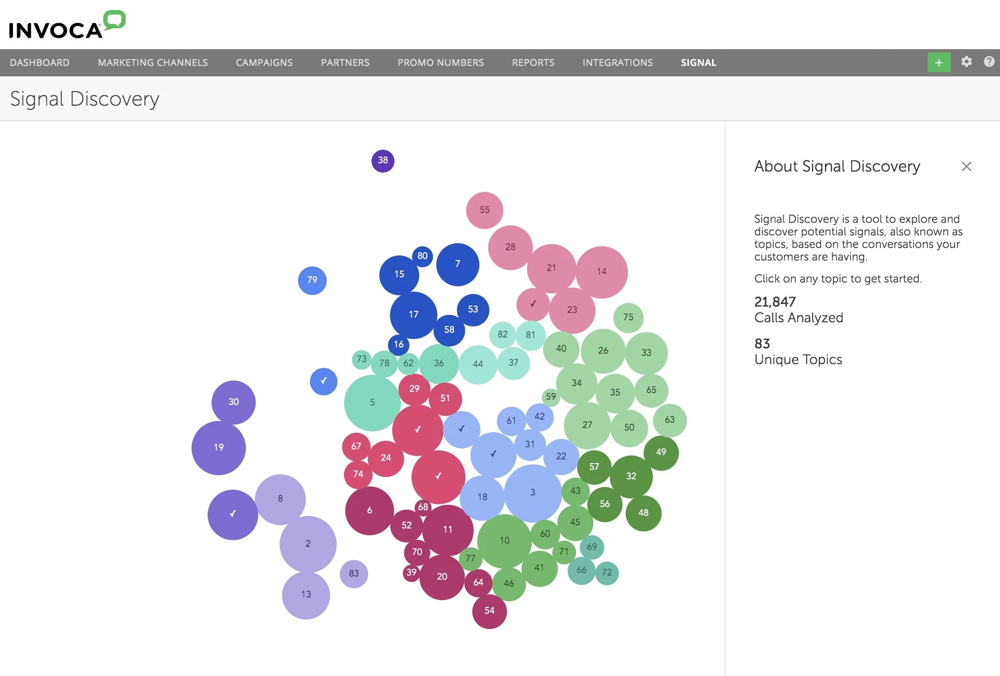
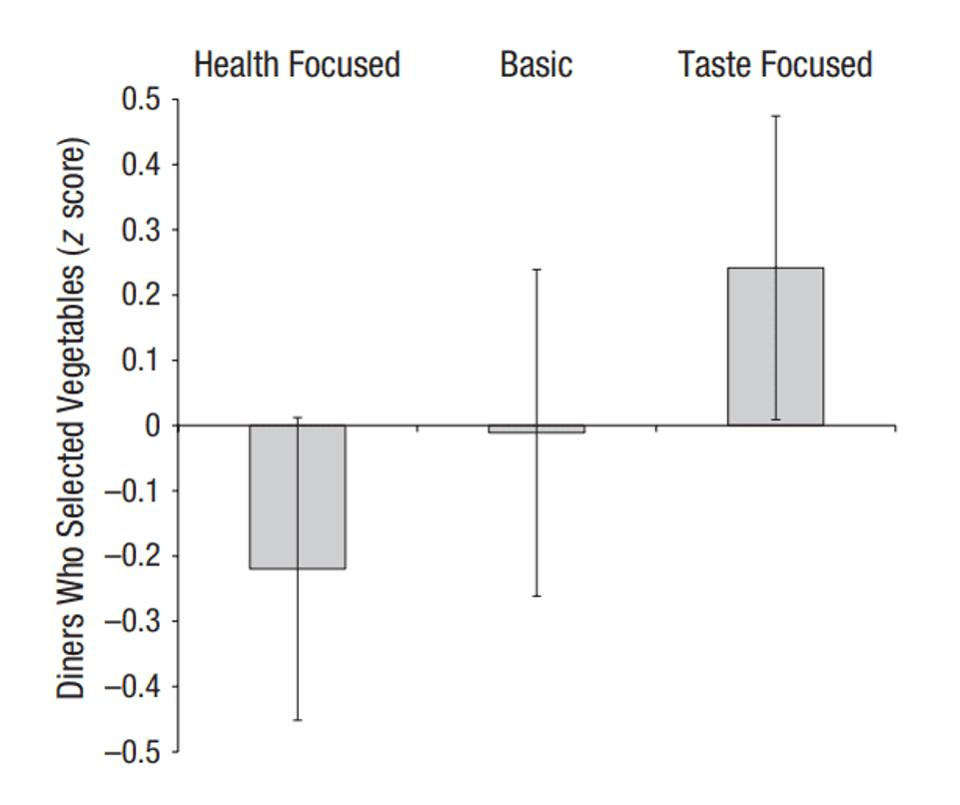
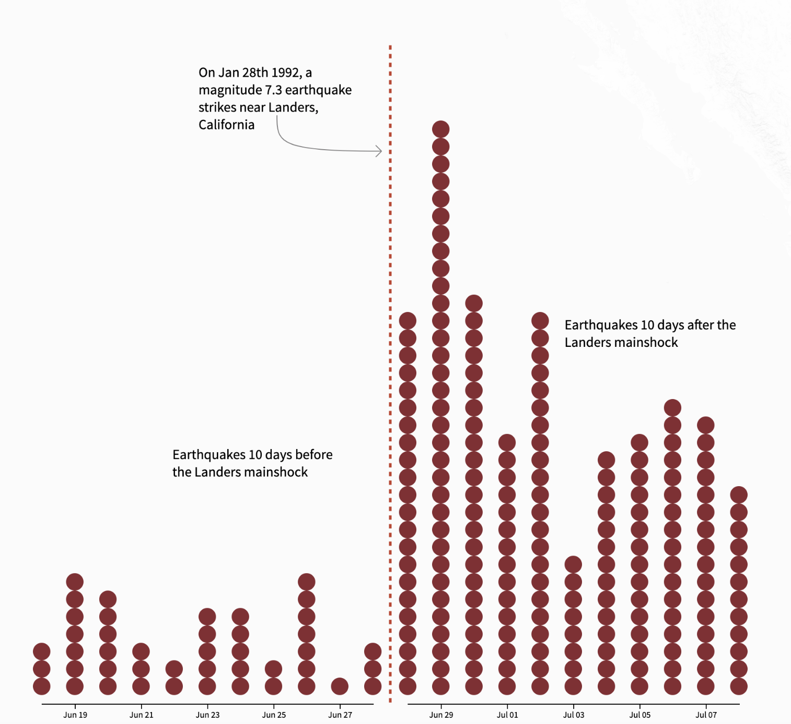
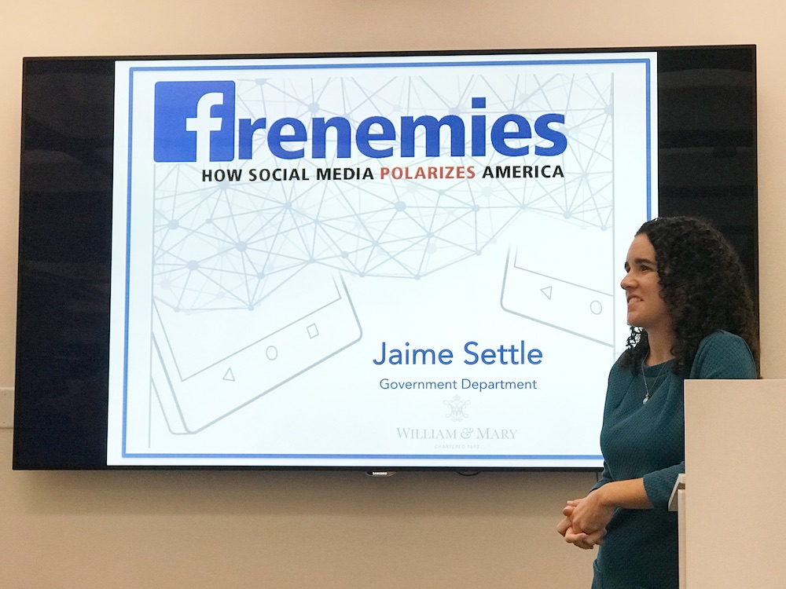
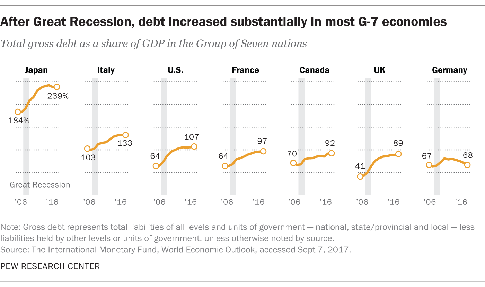
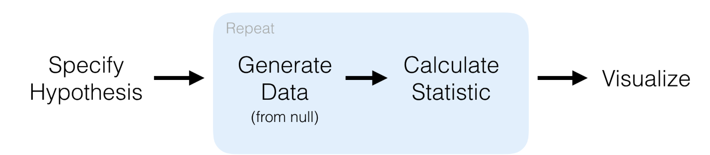

We deliver a collection of timely, relevant, and curious topics across a broad landscape of interests. Join us, give us your feedback and sign up for our free weekly newsletter designed to nurture, expand, and engage the diverse world of data science. 

[Email us to receive our slides from Predictive Analytics World](mailto:consultation_request@paradigmdata.io). The slides outline a framework to build an analytic mindset, including real-world examples from companies like Lyft and Citrix. Please [reach out](mailto:consultation_request@paradigmdata.io) to us with feedback or to meet with us for a free consultation about how we can help train your teams in data science. 

We've also published an ebook for getting started in RStudio, Git, and Github. Check it out[ here](https://leanpub.com/showingyourwork/).

* * *

## Tech >

### Scaling insights in human constrained businesses

The promise of AI has largely begun around automation to drive business efficiencies. Fast food companies are [implementing automation](https://www.businessinsider.com/mcdonalds-kfc-panera-robot-employees-2018-6) for order processing, food preparation and equipment maintenance. Order growth is supported by increased availability of staff previously occupied by these now automated tasks. The call center market faces a similar challenge where the constraint is staff and automation needs to offload tasks from people and informing decisions. Companies like [Invoka](https://go.invoca.com/demo-lp-branded-o.html?utm_source=paid_search&utm_medium=adwords_gs&utm_content=product&utm_campaign=demo_branded_o&ppc_campaign=branded&adgroup=branded_-_short&utm_term=invoka&_bt=320249797345&_bm=e&_bn=g&gclid=Cj0KCQjwrrXtBRCKARIsAMbU6bFG1ZNHyf7n6F3aMBufK3Cfzg02zBigohHP4Vakr9O6Ksms6RNDWVAaAhfwEALw_wcB) and [Twilio](https://www.twilio.com/learn/contact-center/call-center-software-solution) are leading an AI powered value proposition to build similar efficiencies including automated call routing, detecting events like appointment setting and purchases and segmenting calls by topic. The opportunity for businesses is tremendous considering it is estimated that [$1 trillion in consumer spending](http://www.biakelsey.com/research-data/current-research/call-commerce-1-trillion-economic-engine/) will be influenced by click-to-call web integrations. Actionable insights are the name of the game where an Invoka ecommerce customer could see a caller dashboard with the items in their cart, recent web page views and estimated household income. Call topics can give marketers the opportunity to push customers to third party marketing platforms to generate new partnership opportunities. In this space applications of AI appear more about improving our ability to work especially when new information can change an existing decision.   

source: [Invoca raises $56 million to apply AI and analytics to voice calls](https://venturebeat.com/2019/10/17/invoca-raises-56-million-to-apply-ai-and-analytics-to-voice-calls/) 

# *LAFD expands its technology strategy in the sky*

The Los Angeles Fire Department is gaining flexibility in it’s response to the over 492,000 calls it takes each year by expanding a drone program as part of its $691 million dollar budget. The LAFD has partnered with Chinese drone company [DJI](https://www.dji.com/) for its fleet of 11 drones used to add valuable insights to command and support teams on the ground. Drones can add layers of information including showing what is visible and invisible using infrared technology. The brush fire data collected by the drone can then be instrumented into map layers to record and track hot spots. In 2018 the [Camp Fire](https://en.wikipedia.org/wiki/Camp_Fire_(2018_Wildfire)) became the deadliest and most destructive wildfire in California history. The fire killed 85 civilians and caused $16.5 billion dollars in damage to the [town of Paradise](https://en.wikipedia.org/wiki/Paradise,_California). Detection and recording of risk were at the center of the fire’s ignition. PG&E has started experimenting with drones to [inspect gas and electrical infrastructure](https://www.pge.com/en/about/newsroom/newsdetails/index.page?title=20160518_pge_testing_safety_drones_to_inspect_electric_and_gas_infrastructure) following the Camp Fire. Delivering real time situational awareness to response teams allows interventions to take place before the threat escalates. As technology to support the physical world expands, people can become even more efficacious agents themselves.   

source: [The Los Angeles Fire Department wants more drones](https://techcrunch.com/2019/10/20/the-los-angeles-fire-department-wants-more-drones/) 

## Health & Medicine >

# *Messaging impacts vegetable consumption among young people*

More than [57.9 percent](https://www.theatlantic.com/health/archive/2016/03/more-than-half-of-what-americans-eat-is-ultra-processed/472791/) of Americans’ calories come from ultra-processed foods. These foods account for 90 percent of the added sugar that we consume. This absence of these nutrient rich foods like fruits and vegetables in our has led Bradley Turnwald at Stanford to better understand how to get college students to eat more vegetables. A randomized controlled experiment was designed where vegetables were given different descriptions to test how they impacted consumption. The researchers compared taste-focused, health-focused and no-description labels. For example, turnips may be labeled "Herb n’ Honey Balsamic Glazed Turnips" one day, “Healthy Choice Turnips” another day and just “Turnips” another. Students consumed vegetables 29 percent more often when taste-focused labels were used compared with health-focused labels.  The health-focused labels reduced the frequency of vegetable consumption leading researchers to re-evaluate how foods are labeled to students. 

source: [Stanford Psychologists Entice Students To Eat More Veggies](https://www.forbes.com/sites/traversmark/2019/10/10/stanford-psychologists-entice-students-to-eat-more-veggies/#2782a9cca40e) 

* * *

## Science >

### Following earthquake patterns across the globe

Will Chase takes us on a guided tour of the patterns between quakes around the globe. He starts with the 1992 quakes in Southern California that were followed by more after the larger event. His beautiful visualizations are accompanied by an evidenced based narrative through a trip around the globe and how larger earthquakes appear to trigger many smaller ones.

source: [Can One Earthquake Trigger Another On The Other Side Of The World?](https://will-r-chase.github.io/eq_bw/) 

* * *

## Money >

### Teachers are positioned to benefit from investment reform

American educators do not benefit from their investments equally to the rest of America due to the high feels and limited stock market exposure from their nearly $1 trillion dollars in retirement savings. The reasons go back to insurance companies dominating the marketplace resulting in  [76% of assets](https://www.investmentnews.com/article/20191003/BLOG03/191009964/investigation-into-403-b-costs-sales-could-be-an-a-for-teachers) held in variable or fixed annuities compared with less than 10% in 401(k) plans. These investments have high expenses that can be multiples of a traditional 401(k) and thus transferring retirement savings from their owners to insurance companies. The [SEC investigation](https://www.wsj.com/articles/sec-launches-investigation-of-practices-in-retirement-plans-for-teachers-government-employees-11570651944) means to probe the marketing practices of these insurance companies for deceptive practices in which investments were not accurately represented. Furthermore consumers do not share the same protections as 401(k) investors under the [Employee Retirement Income Security Act](https://www.dol.gov/general/topic/retirement/erisa). Insurance companies were allowed to exempt American education retirement funds to be defined as employer-sponsored. This exemption deregulated the insurers from the protections shared by other investors.  

*source*: [403(b) Retirement Accounts: A History and Evaluation](https://www.prosperous.finance/news-notes/2019/4/1/403b-retirement-accounts-a-history-and-criticism) 

## * * *

## Media & Politics >

### Are you feeling the polarization? 

Jaime Settle studies the impact of social networks on our political psychology. In her book, "Frenemies: How Facebook Polarizes America," Settle proposes that it is not what we consume but rather what we associate it with that we are dependent on to shape our interpretation. She points to a statistic that 50 percent of Republicans and nearly one-third of Democrats would be concerned if their child married to a member of another political party. This distinction, she says, was of little importance in the 1960s. Settle designed an experiment to better understand a phenomenon where “78 percent of Facebook users said they don’t or seldom share political content while 69 percent of them said they understand others political views through Facebook.” Participants were shown to determine if content was political when the source of the content changed. In Settle’s [experiment](https://jsettle.people.wm.edu/research.html) the source of the content was changed but not the content itself. For example, when Fox News was labeled the source 50 percent of participants said it was from a Republican compared with only 40 percent when no source was listed. Settle points to the [out-group homogeneity effect](https://en.wikipedia.org/wiki/Out-group_homogeneity) as negatively impacting our ability to engage and understand each other. 

*Ｗe believe that conservative people are surrounded by conservative friends and that extremists have friends with the same extreme ideology.*

The result is that unfounded biases are supported and we build a feedback loop of believing that a group is homogenous and that we disagree with the group as a whole.

source: [Jamie Settle on how social media polarizes America](http://www.storybench.org/jamie-settle-on-how-social-media-polarizes-america/)

* * *

## R-roundup >

### How Pew Research Center uses small multiple charts

* Check out the design guide and implementation of faceting with this use case at Pew.

**Source: ****[How Pew Research Center uses small multiple chart**s](https://medium.com/pew-research-center-decoded/how-pew-research-center-uses-small-multiple-charts-2531bfc06419)

### Exploring data with drag-and-drop in R

https://miro.medium.com/max/2024/0*6DW7UVEqL0QcV5nw.gif

* Exploring data is a skill and sometimes having a tool to transition into writing code for visualization can be helpful. This tutorial and accompanying video is a use case for replicating a Tableau like experience in R.

**_Source: _****_[Tableau-like Drag and Drop GUI Visualization in _**R](https://towardsdatascience.com/tableau-esque-drag-and-drop-gui-visualization-in-r-901ee9f2fe3f)**_ _**

### Statistical tests and visualizations using Infer

* Using Tidy approach to statistical tests using Infer.

**_Source: _****_[Tidy Chi Squared stats in infe_**r](https://richpauloo.github.io/2018-02-03-Tidy-Chi-Squared-stats-in-infer/)**_ _**

### Data Journalism and Visualization with Free tools

* The main goal of this course is to prove to you that doing journalism with data and designing compelling charts, maps, and graphics is not magic, but a matter of learning some key principles, skills, practicing, and receiving feedback. We are convinced that anybody can learn the basics if you are willing to make a little effort. The course provides enough materials for you to get started.

**_Source: _****_[Data Journalism and Visualization with Free Tool_**s](https://journalismcourses.org/DATA0819.html?utm_source=ActiveCampaign&utm_medium=email&utm_content=Last+call%3A+FREE+data+journalism+++visualization+course&utm_campaign=MOOC%3A+Data+Journalism+and+Visualization+with+Free+Tools+-+Email+3rd)**_ _**

Follow us

[@datasartoriasf](https://twitter.com/datasartoriasf)

[@mjfrigaard ](https://twitter.com/mjfrigaard)

[Peter Spangler](https://www.storybench.org/author/spangler/)

[Martin Frigaard](http://www.storybench.org/author/martinfri/)

[Paradigm Data Group](https://www.paradigmdata.io/)

