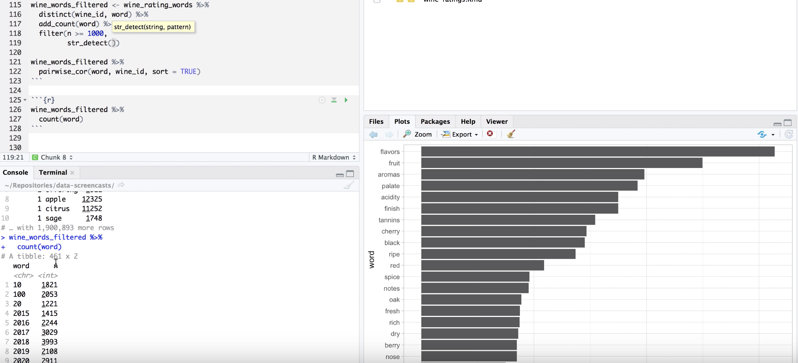

We deliver a collection of timely, relevant, and curious topics across a broad landscape of interests. Join us, give us your feedback and sign up for our free weekly newsletter designed to nurture, expand, and engage the diverse world of data science. 

 [Email us to receive our slides from Predictive Analytics World](mailto:consultation_request@paradigmdata.io). The slides outline a framework to build an analytic mindset, including real-world examples from companies like Lyft and Citrix. Please [reach out](mailto:consultation_request@paradigmdata.io) to us with feedback or to meet with us for a free consultation about how we can help train your teams in data science. 

We've also published an ebook for getting started in RStudio, Git, and Github. Check it out[ here](https://leanpub.com/showingyourwork/).

* * *

## Tech >

### Social media platforms don’t scale safety

In two years, Tyler Baumann made 5 million dollars leveraging the Instagram algorithm and platform to create the most extensive underground steroid lab in the market. The Boston based bodybuilding enthusiast grew a following on IG as an early adopter in 2014, where he reviewed black market steroids and guided users in their steroid use among 100k followers. His adoption of the Onyx Pharmaceuticals brand, a subsidiary of the pharma giant Amgen, to market his steroids business on a separate IG page created brand recognition. Baumann could use the brand hashtag on his personal IG page to ensure his followers would be pushed to his steroid business to generate the $10k per day in sales he accumulated. FBI investigators eventually discovered his business, and sentenced Baumann to 10 years in prison. What remains an open issue is the prevalence of drug businesses on social platforms like IG and Facebook. The lack of scalability in detection and enforcement has enabled the illicit drug trade to move online.     

source: [How to Sell Drugs and Influence Everyone on Instagram](https://www.bostonmagazine.com/health/2019/10/15/instagram-drug-market/) 

# *Can technology build a reluctant habit?  *

As of today, October 28, [Peloton](https://www.google.com/search?tbm=fin&sxsrf=ACYBGNRfbsxAR5yVn9KmKBAArqS63jRHSw:1572291348163&q=NASDAQ:+PTON&stick=H4sIAAAAAAAAAONgecRowS3w8sc9YSn9SWtOXmPU5OIKzsgvd80rySypFJLmYoOyBKX4uXj10_UNDTNMzcoNTJLSeBax8vg5Brs4BlopBIT4-wEARgErPEwAAAA&biw=1294&bih=860#scso=_MkO3XZ_gHNHY-wTA04SAAQ7:0) has lost 16% of its value since it went public on September 27 this year. The company builds a stationary bike with an iPad like device to subscribe to its classes and trainer content. Earlier this year, Peloton was the subject of a [$300 million lawsuit](https://www.marketwatch.com/story/peloton-has-spent-506-million-on-music-but-this-suit-says-it-owes-300-million-more-2019-09-16) that claimed it violated copyright laws by using music from artists like Adele, Beyonce, and John Legend without paying for its use. Even with these  financial challenges, Peloton represents a growth industry that is "boutique fitness". In recent years, traditional gym membership grew by 5% compared to boutique memberships that [grew by 70%](https://insider.fitt.co/boutique-fitness-boom-numbers-statistics/). There is a sense of personalization and identity that define these businesses compared with the more diverse types of exercisers at a commercial gym. People congregate and engage with others like themselves, in and out of the gym. In San Francisco’s Mission neighborhood, Danielle Repetti is counting on it. [Iron + ](https://hoodline.com/2019/10/women-focused-weightlifting-studio-opens-in-the-mission)[Mettle](https://hoodline.com/2019/10/women-focused-weightlifting-studio-opens-in-the-mission) is a strength training facility for people that identify as women. Memberships cost between $319 to $499 per month compared with a group-membership to a non-personalized experience like [Crunch Fitness](https://www.crunch.com/), which costs less than $100 per month. The move toward identity-based products certainly personalizes the experience and creates greater homogeneity, but it also offers less diversity). In a traditional gym, members from different walks of life have to communicate, interact and create the experience together.. Our common spaces are growing more self-selected at a time when communication in the culture as a whole feels strained. Is it best that we have fewer and fewer places where we encounter difference?

source: [How Peloton made sweat addictive](https://techcrunch.com/2019/09/22/why-buy-peloton/) 

## Health & Medicine >

# *Smoking cessation drug Chantix linked to violent behavior*

[The Institute for Safe Medication Practices](https://www.ismp.org/) released the results of a 2011 study demonstrating that patients taking the smoking cessation drug Chantix are 8.4 times more likely to lead to suicide or self-injury compared to nicotine replacement products like nicotine gum or patches. These data were supported by 2010 research that showed Chantix had the most reported cases of violence -- a total of 408 -- of any drug reported to the FDA since 1968. Patients who have suffered these impacts are now revealing their specific experiences, including a recent article authored by nationally recognized pharmacologist [Joe Graedon](https://www.npr.org/podcasts/381444414/the-people-s-pharmacy-radio-program) and medical anthropologist [Terry Graedon](https://www.npr.org/podcasts/381444414/the-people-s-pharmacy-radio-program) who host the NPR program  [The People's Pharmacy](https://www.peoplespharmacy.com/). Their latest [report](https://www.spokesman.com/stories/2019/oct/23/peoples-pharmacy-can-stop-smoking-drug-trigger-vio/) details the experience of a male patient who found himself taking extreme risks driving, operating at his job, and in a violent street fight after only taking Chantix for three months. The behaviors all came to a stop after no longer taking the drug. Joe and Terry Graedon were familiar with the effects,

*We have heard from other readers that varenicline (Chantix) can trigger uncharacteristic violent thoughts or actions. The Food and Drug Administration also has received reports of traffic accidents and other accidental injuries linked to this stop-smoking drug.*

Frequently,  our main effect is not the only effect. In complex systems like human physiology, we cannot always know the potential downstream impacts. In cases like Chantix, it appears the risks--including self-harm and sucicide--are more acute and potentially adverse compared with earlier tobacco replacement products like nicotine gum.   

source: [Chantix: News about increased risk of suicide, violent behavior, and other mental health problems](http://www.center4research.org/drugs-quit-smoking-can-affect-mental-physical-health-truth-chantix-zyban/) 

* * *

## Science >

### The science of mental health care

Servicemen and women that deployed to combat zones face several challenges when returning home that are unique to their experience and require specific resources. Up to 20% of returning service members suffer from post-traumatic stress disorder, and up to 47% suffer from sudden outbursts of anger. These strains put pressure on their ability to adjust to civilian life and function within relationships, including family and professional settings. Welcome Back Veterans (WBV) is part of the Veterans Administration’s effort to expand resources into community clinics to meet the need for treatment. The lack of integration between private providers and the communication and billing systems used by the VA has created a gap in the ability to onboard providers and identify best practices based on treatment outcomes. Like WBV, [America's Warrior Partnership](https://www.google.com/search?q=America%E2%80%99s+Warrior+Partnership&oq=America%E2%80%99s+Warrior+Partnership&aqs=chrome..69i57j0l5.1539j0j7&sourceid=chrome&ie=UTF-8) is filling the gap with technology solutions to connect providers with the domain specific areas of need for service members. The long term goal is to integrate more private providers into a network of treatment resources for service members regardless of their location . Coordination and technology solutions are necessary to support a cross-functional effort between private-sector medical providers and the VA.

source: [The Changing Landscape for Veterans' Mental Health Care](https://www.rand.org/pubs/research_briefs/RB9981z2.html) 

* * *

## Money >

### Uber wants to be your bank

Following a [wave of layoffs](https://www.nytimes.com/2019/10/14/technology/uber-layoffs.html) focused on marketing, autonomous vehicles, customer support, and operations, Uber is hoping that you will trust them with your finances. Uber plans to roll out the Uber Money division, where they will focus their products on delivering financial services to drivers. There is a significant population of *unbaked *drivers in the rideshare space where Lyft has tried to fill that gap with their [no-fee bank account](https://www.bizjournals.com/southflorida/news/2019/03/27/lyfts-no-fee-bank-account-for-drivers-could-aid.html) product. These populations are more vulnerable to fees. The Economic Policy Institute found that Uber drivers make less in wages than 90% of all American workers. The pressure to be profitable is motivating the rideshare business to improve driver loyalty through these types of benefits. Uber’s credit card for passengers is a similar strategy designed to offer rewards and discounts on food and rides to win passenger frequency against Lyft. Passenger loyalty has been a hard target for both brands, where the commoditization of ‘rides’ moves passengers to either service-based or the lowest price. Discounting has not proved a globally successful strategy without focusing on passengers who ride frequently. Moving into new verticals like finance will be an exciting development to observe as Uber tries to find a path to profitability and has recently seen a great deal of thrash between strategies.

*source*: [Uber announces deeper push into financial services with Uber Money](https://www.cnbc.com/2019/10/28/uber-announces-deeper-push-into-financial-services-with-uber-money.html) 

## * * *

## Media & Politics >

### Female medical experts face a disparity of influence in social media

Despite the growth of platforms that appear to democratize influence in social media, the actual weight of said influence is demonstrably uneven. Researchers at the [University of Pennsylvania School of Medicine](https://www.med.upenn.edu/) found that despite similar levels of activity on Twitter, women’s posts generated 45% fewer average likes and 48% fewer average retweets compared with their male peers. Rachel M. Werner, MD, Ph.D., executive director of Penn's Leonard Davis Institute of Health Economics commented on the study:

*However, our study clearly shows that unfortunately women's voices are less influential, even on Twitter, which suggests social media may in fact have the opposite effect.*

Women attracted only half as many followers as men, and enormous disparities of  influence were most profound among full professorships. This influence disparity is not difficult to find in web publications. The website [Statnews](https://www.statnews.com/) published [18 must-follow Twitter accounts about health and medicine](https://www.statnews.com/2015/12/30/18-twitter-feeds-health-medicine/) of which 65% were men. Platforms like Twitter are central repositories for influence, networking, and sharing research for universities and institutions across the country. Younger researchers were found to show much less disparity between men and women, suggesting that a trend may be toward being similarly acknowledgeable among the next generation of academics. 

source: [Women have substantially less influence on Twitter than men in academic medicine](https://www.sciencedaily.com/releases/2019/10/191014111742.htm)

* * *

## R-roundup >

### Stackoverflow data by Julia Silge

* Checkout Julia’s analysis of weekend vs weekday traffic at Stackoverflow!

**Source: ****[Research update: Coding on the Weekend**s](https://stackoverflow.blog/2019/10/28/research-update-coding-on-the-weekends/)

### Exploring average incomes in maps

* A great tutorial on plotting maps of spain in ggplot2.

**_Source: _****_[Average income at the local leve_**l](https://github.com/aaumaitre/maps_Spain/blob/master/README.md)**_ _**

### R Video Series for common solutions

* Do More with R is a video series of 30 videos for common questions.

**_Source: _****_[Do More with _**R](https://www.infoworld.com/article/3411819/do-more-with-r-video-tutorials.html)**_ _**

### #TidyTuesday Wine Ratings Prediction

* David Robinson takes us on a statistical tutorial of enology.

**_Source: _****_[Tidy Tuesday screencast: predicting wine rating_**s](https://www.youtube.com/watch?v=AQzZNIyjyWM)

**_ _**

### Horror movie ratings 

* Thanks to Verrle van Son for sharing this resource.

**_Source: _****_[Horror Movie Ratings TidyTuesda_**y](https://gitlab.com/snippets/1907498)**_ _**

### Learning statistics with R Resources

* Thanks to Mara Averick for sharing this resource.

**_Source: _****_[Learning Statistics with R by Danielle Navarro_** ](https://learningstatisticswithr.com/)**_ _**

Follow us

[@datasartoriasf](https://twitter.com/datasartoriasf)

[@mjfrigaard ](https://twitter.com/mjfrigaard)

[Peter Spangler](https://www.storybench.org/author/spangler/)

[Martin Frigaard](http://www.storybench.org/author/martinfri/)

[Paradigm Data Group](https://www.paradigmdata.io/)

