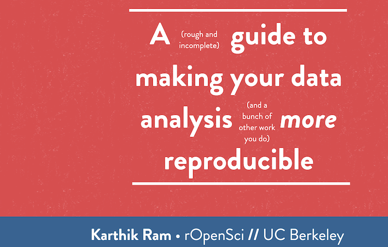
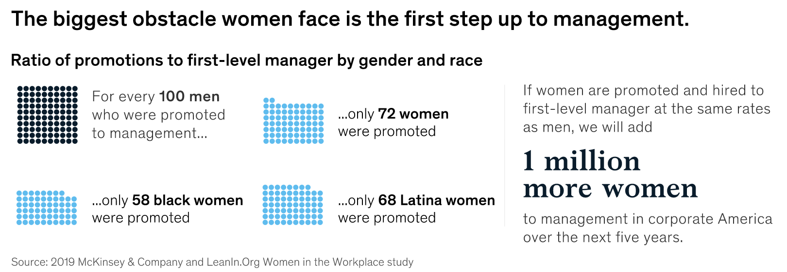
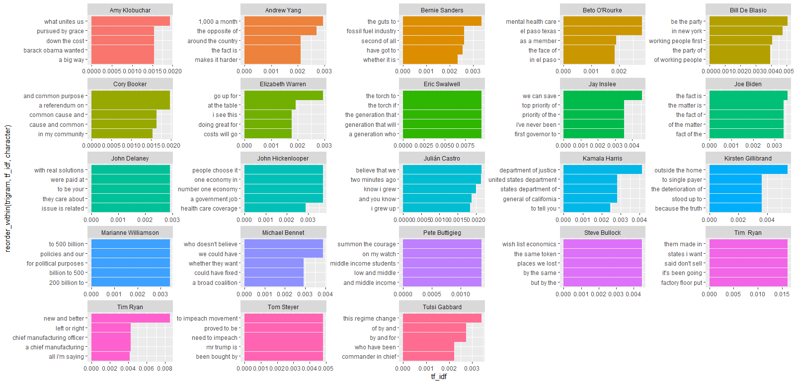
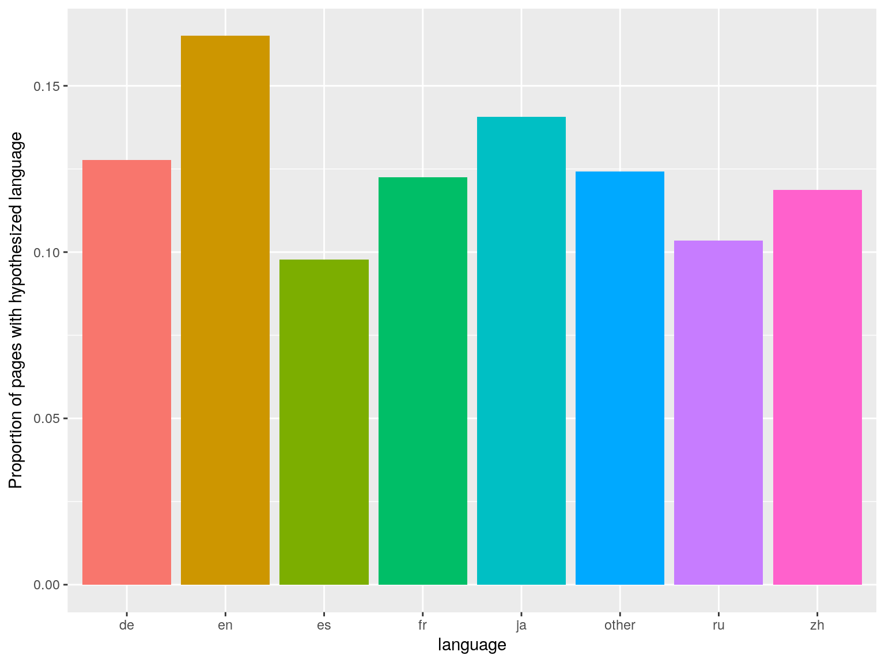
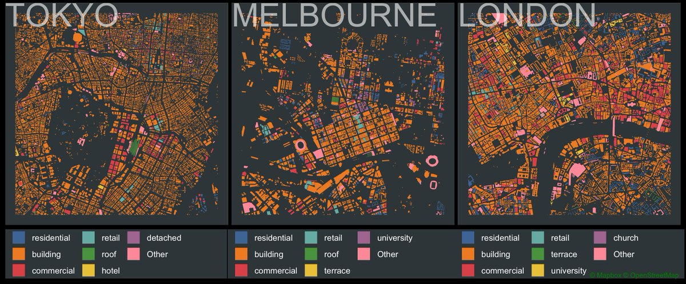

We deliver a collection of timely, relevant, and curious topics across a broad landscape of interests. Join us, give us your feedback and sign up for our free weekly newsletter designed to nurture, expand, and engage the diverse world of data science. 

 [Email us to receive our slides from Predictive Analytics World](mailto:consultation_request@paradigmdata.io). The slides outline a framework to build an analytic mindset, including real-world examples from companies like Lyft and Citrix. Please [reach out](mailto:consultation_request@paradigmdata.io) to us with feedback or to meet with us for a free consultation about how we can help train your teams in data science. 

We've also published an ebook for getting started in RStudio, Git, and Github. Check it out[ here](https://leanpub.com/showingyourwork/).

* * *

## Tech >

### Greek myths have some scary ideas about robots and A.I.

We often think of ourselves as newly discovering the world; uncovering ideas and instrumenting those ideas into technologies that set us apart from our ancient and less sophisticated progenitors. [Adrienne Mayor's](https://web.stanford.edu/dept/HPS/Mayor.html) latest work [Gods and Robots: Myths, Machines, and Ancient Dreams of Technology](https://press.princeton.edu/books/hardcover/9780691183510/gods-and-robots) suggests that when it comes to conceiving of artificial intelligence and robots we are more inheritors than creators. "*Our** ability to imagine artificial intelligence goes back **to the ancient** times," *says Mayor*. *The 2,700 year old story of Talos is one of these earliest conceptions. 

*The myth describes Talos as a giant bronze man that Hephaestus, the Greek god of invention and blacksmithing, built. Zeus, the king of Greek gods, commissioned Talos to protect the island of Crete from invaders. He marched around the island three times every day and hurled boulders at approaching enemy ships.** *

Mayor’s work not only delivers on the history of ideas around artificial intelligence but also how ethical implications have been explored. A theme of chaos and destruction surrounds the myths once these beings of artificial intelligence are controlled by humans. Mayor calls the phenomena of humanity's interest in creating life a "...timeless link between imagination and science." 

source: [Greek Myths Have Some Scary Ideas About Robots and A.I.](https://www.futurity.org/artificial-intelligence-greek-myths-1999792/) 

# *The Spotify playbook for optimizing a free to paid strategy *

46% of the 248 million Spotify users are now premium subscribers to the $9.99 per month individual or $14.99 per month family plan. This represents a 31% year-over-year growth in converting free to paid users for the platform, but how did they do it? The freemium model is predominant in the world of SaaS where a user can only get access to a basic experience and must pay for nice to have features. Identifying the inflection points of stickiness with engagement must be supported by user behavior signals to create a recipe for customer success. An experiment among free users where a portion were given unlimited skips resulted in this new feature being added to the Premium product in Spotify. Additionally, users can now save the content that they engage with through a download option. [Dropbox tiers](https://www.dropbox.com/individual/plans-comparison) work similarly where upgrading from free to the first paid tier gets you 1,000X more data for $9.99 per month. Interruption is always a point of aggravation in freemium products. In Spotify users don’t want to have their favorite playlist interrupted by advertising. Similarly, [Zoom limits meetings to 40 minutes](https://zoom.us/pricing) for its freemium product but those who want longer calls must upgrade to a paid tier. Identifying where a product is adding the most value requires partnerships that are customer success focused. Instead of moving customers where a team wants them to go, observe, enrich and follow their lead. 

source: [Spotify Found a Surprising Way to Convert Free Users to Paying Customers: Even More Freebies](https://fortune.com/2019/10/28/spotify-premium-users-increase/?es_p=10459047) 

## Health & Medicine >

# *Retain muscle and balance with strength training*

Dr. Catherine Walter is a 72 year old powerlifter who came to strength training in her 60s and is seeing the benefits from the inside out with the bone density of a 20 year old. Professor Dame Sally Davis, Chief Medical Officer for England is supportive,

* Physical activity is an under-appreciated asset in our clinical arsenal. It is cheap and brings a long list of health benefits.*

We lose muscle mass and bone density after 50 which results in greater risks of falls, physical ability and the consequence of falls. In America the [risk of sedentariness](https://www.ncbi.nlm.nih.gov/pmc/articles/PMC6187798/) is associated with as much as a 40% increase in all cause mortality and chronic diseases including type 2 diabetes. New guidelines recommend breaking up sedentary periods even for people who exercise weekly. Both the UK Chief Medical Officers’ and United States’ [Office of Disease Prevention and Health Promotion](https://health.gov/paguidelines/second-edition/pdf/PAG_ExecutiveSummary.pdf) recommends that adults should get at least 150 minutes of moderate exercise per week where at least 2 of those days include strength training. Aerobic activity has long been a recommendation for healthy adults and now the benefits of strength training are supported by greater evidence as fundamental to healthy aging.  

source: [Weight lift twice a week to improve bone density, adults told](https://news.sky.com/story/weight-lift-twice-a-week-to-improve-bone-density-adults-told-11804129) 

* * *

## Science >

### Building reproducible discovery in science

During a recent [meetup](https://www.meetup.com/Bay-Area-Biotech-Pharma-Statistics-Workshop-BBSW/events/265042071/) on the topic of reproducibility in the development of pharmaceuticals [Qinghua Song](https://www.linkedin.com/in/song-qinghua-40352b12/) shared how [Gilead and Kite](https://www.gilead.com/about/us-locations) are paving a path toward shared methods in data analysis. The growth of opportunity to analyze data has brought the challenge of producing the same result between analysts which leads to confusion and an absence of confidence from leaders. Delivering agreed upon methods built into self service tools creates efficiencies and value for organizations that depend on high confidence outcomes.  [Michael Lawrence](https://www.linkedin.com/in/michael-lawrence-74a9b482/) laid out a roadmap for an analytics community made up of contributors and leaders that could scale value by surfacing methods and empowering individual impact. As analytics functions grow across business units it is critical to document and organize how work is done. Similar to the rapid growth in the development of software, we are now faced with a workflow challenge. [Karthik Ram](https://www.linkedin.com/in/karthik-ram-93334954/)’s presentation from the RStudio Conference in 2019 and his [GitHub](https://github.com/karthik/rstudio2019) provide an analytical framework for reproducibility in the RStudio environment. The dependence on reproducibility in pharma is uniquely critical compared with much of tech where the risk of failure day to day is much smaller. Despite that difference, those working in analytics and tech leaders would do well to consider the opportunity to build greater confidence and efficiencies in their teams’ work product.

source: [A guide to modern reproducible data science with R - Karthik Ram](https://resources.rstudio.com/rstudio-conf-2019/a-guide-to-modern-reproducible-data-science-with-r) 

* * *

## Money >

### Your personality is your credit scorecard

###  

According to the Consumer Financial Protection Bureau nearly [20% of Americans have no credit score](https://files.consumerfinance.gov/f/201505_cfpb_data-point-credit-invisibles.pdf). These are often lower income adults that remain invisible to businesses who could otherwise offer credit solutions available to other Americans. [Entrepreneurial Finance Lab](https://www.fernsoftware.com/blog/entrepreneurial-finance-lab-credit-scoring-by-personality-tests/) has been experimenting with psychometric based scoring to deliver credit in a space where traditional data is absent and alternative measurements of risk are needed. Personality characteristics can contribute to a highly accurate assessment of an individual’s risk says Tripp Rockwell of behavior based tech company [DNA Behavior](http://dnabehavior.com/about-us/).  

*These systems uncover the hidden traits and styles that are hard-wired into an individual’s personality that may otherwise go unnoticed... Psychometrics applied to financial behavior provide a 91 percent accuracy in predicting how an individual makes financial decisions.*

Filtering out bias is a critical component to credit scoring. Recently companies have begun experimenting with payment histories such as rent to estimate credit worthiness. [More U.S. households are headed by renters than anytime in history](https://www.pewresearch.org/fact-tank/2017/07/19/more-u-s-households-are-renting-than-at-any-point-in-50-years/) thus increasing the availability of this datapoint to potential creditors. As we seek and find success in  alternative measurements for credit the importance of privacy will escalate to so that consumers are informed where there data is being shared. 

*source*: [Could Personality Tests One Day Replace Credit Scores?](https://www.forbes.com/sites/andrewjosuweit/2018/04/25/could-psychometrics-predict-your-financial-behavior/#50ccbc8e6e8b) 

## * * *

## Media & Politics >

### Measuring gender progress in the workplace 

McKinsey’s annual report assessing the state of women in the workplace identifies progress in the areas of sentiment and senior leadership but an overall gap in equality of opportunity. The impact is magnified in each step of upward mobility where 62% of manager roles are held by men the result is fewer and fewer potential female candidates at each incremental step of leadership. Quantitative measures of success are important here. For example, 44% of companies had 3 or more women in C suite roles in 2019 compared with only 29% in 2015. However, there was only a 2% absolute growth in female Senior Managers/Directors and only 3% growth in female Vice Presidents over the same 4 year period. Overall women reported a 39% relative increase in the belief that gender diversity is a top company priority. This growth in sentiment appears to over represent the actual outcome performance of our quantitative measures. Mechanistic changes are more challenging to identify and deploy compared with branding or communication. McKinsey identifies the impact of manager support and sponsorship as key drivers to producing measurable change. Only 1 in 4 employees reported having a manager that helped manage their career. Assessing performance means connecting different types of measurement to build a more global understanding. The report is a deeply relevant topic and opportunity for anyone thinking about analytical frameworks and telling stories with data.  	

source: [Women in the workplace 2019](https://www.mckinsey.com/featured-insights/gender-equality/women-in-the-workplace-2019)

* * *

## R-roundup >

### Text Mining with The Democratic Debates

* Checkout [Andrew Couch's](https://towardsdatascience.com/@andrew.couch?source=post_page-----48e3343bb489----------------------) introduction to text mining in R with this example using debate data.

**Source: ****[Text Mining with the Democratic Debate**s](https://towardsdatascience.com/text-mining-with-the-democratic-debates-48e3343bb489)

### Managing Many Models with tidyr, purrr and broom

### 

* Follow along with the full code for analyzing web traffic data using packages for managing models in R.

**_Source: _****_[Managing Many Models with tidyr, purrr and broo_**m](https://www.kaggle.com/timib1203/managing-many-models-with-tidyr-purrr-and-broom)**_ _**

### Buildings by type in three cities

* Great short tutorial on building polygon maps in R.

**_Source: _****_[Building Maps in _**R](https://github.com/adam-gruer/30DayMapChallenge/blob/master/Day03Polygons.Rmd)**_ _**

### Tidy Tuesday screencast: analyzing Simpsons guest stars and dialogue in R

* David Robinson walks us through an exploratory data analysis with the Simpsons.

**_Source: _****_[Tidy Tuesday screencast: analyzing Simpsons guest stars and dialogue in _**R](https://www.youtube.com/watch?v=EYuuAGDeGrQ)

### Building animated bubble charts in R

* [Keith McNulty](https://www.linkedin.com/in/keith-mcnulty/) elegantly presents his approach for an animated visualization in R.

**_Source: _****_[Create Hans Rosling’s famous animated bubble chart in a single piped command in _**R](https://www.linkedin.com/pulse/create-hans-roslings-famous-animated-bubble-chart-single-mcnulty/?trackingId=W5lDyYFLTvSvg1AJ%2FdLjkA%3D%3D)

Follow us

[@datasartoriasf](https://twitter.com/datasartoriasf)

[@mjfrigaard ](https://twitter.com/mjfrigaard)

[Peter Spangler](https://www.storybench.org/author/spangler/)

[Martin Frigaard](http://www.storybench.org/author/martinfri/)

[Paradigm Data Group](https://www.paradigmdata.io/)

