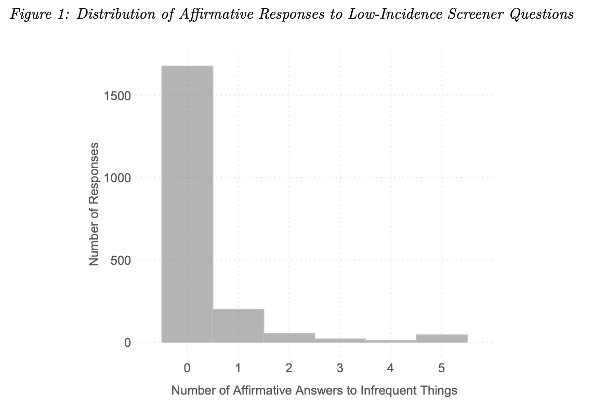
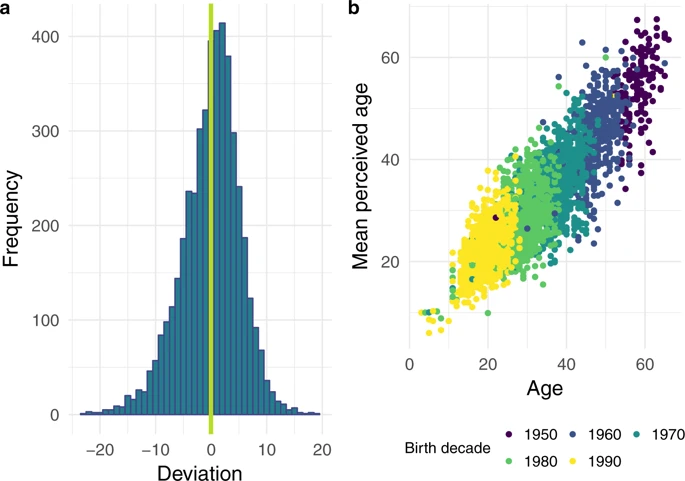
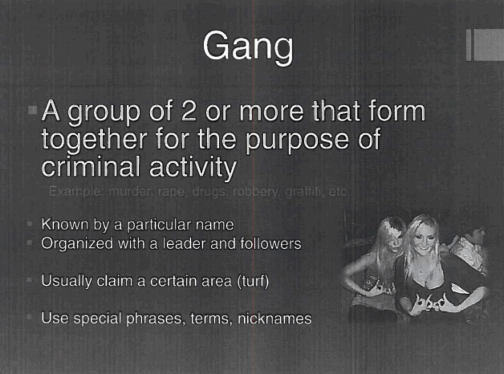
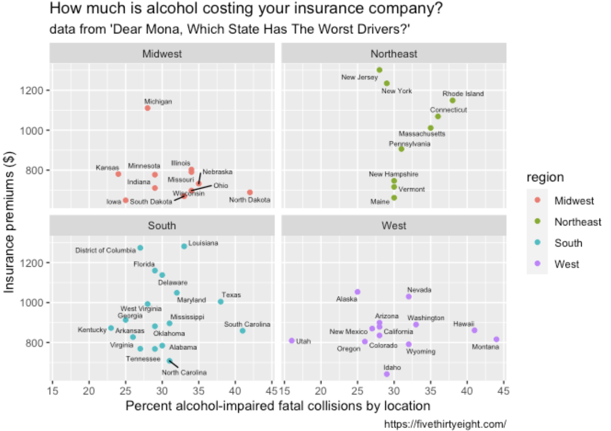
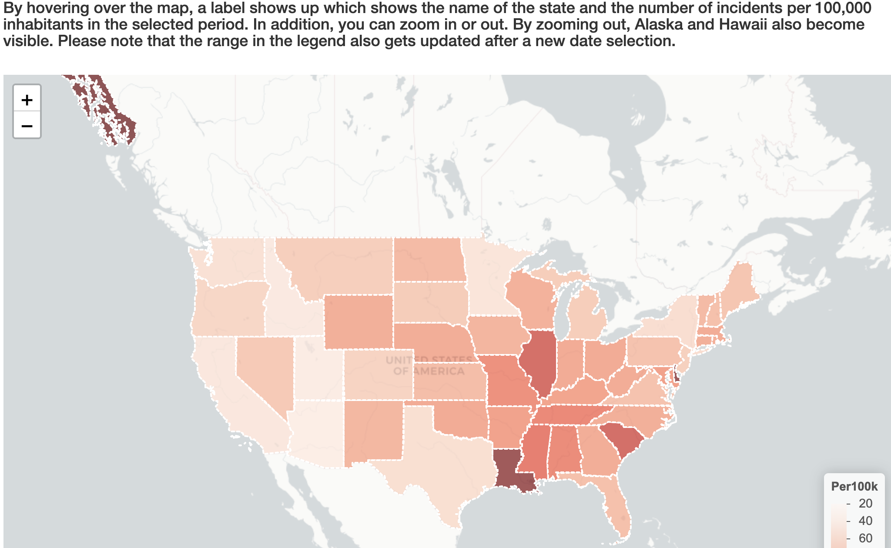
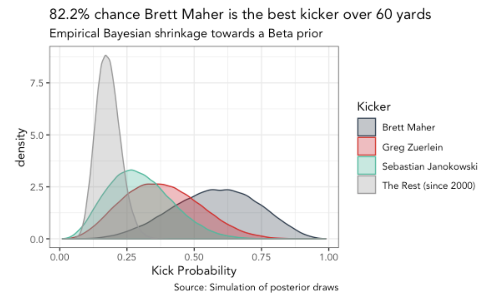

We deliver a collection of timely, relevant, and curious topics across a broad landscape of interests. Join us, give us your feedback and sign up for our free weekly newsletter designed to nurture, expand, and engage the diverse world of data science. 

 [Email us to receive our slides from Predictive Analytics World](mailto:consultation_request@paradigmdata.io). The slides outline a framework to build an analytic mindset, including real-world examples from companies like Lyft and Citrix. Please [reach out](mailto:consultation_request@paradigmdata.io) to us with feedback or to meet with us for a free consultation about how we can help train your teams in data science. 

We've also published an ebook for getting started in RStudio, Git, and Github. Check it out[ here](https://leanpub.com/showingyourwork/).

* * *

## Tech >

### Contrary to popular beliefs, you rarely get what you ask for…

Survey research is used in just about every scientific discipline, especially if they involve human behavior and preferences. We've built the entire field of psychometrics around being able to measure things like cognitive ability, personality, and attitudes. We rely heavily on being able to ask people questions and trusting the information they provide. The essence of democracy operates under the same principle: ballots ask constituents what officials they prefer, and the voter reliably chooses their preferred politician.

But what if we couldn't rely on the information collected in a survey? What if the question we've designed isn't capturing the phenomena we want? What if we asked the right question, but we've asked the wrong people? What if the respondents reliably lie to a particular survey item--do we keep asking it? What if some respondents pay more attention than others? If we ask the same questions to the same people over-and-over, do their answers change? 

These are the types of questions we should all be asking when we read headlines based on survey data. The most recent reminder for staying vigilant and skeptical comes from a paper published in May titled, "[The Micro-Task Market for Lemons: Data Quality on Amazon's Mechanical Turk](http://gsood.com/research/papers/turk.pdf)." 

Amazon's Mechanical Turk was all the craze when it came on the scene around a decade ago, with one [publication](http://datacolada.org/wp-content/uploads/2014/04/Burhmester-Kwang-Gosling-2011.pdf) from Perspectives on Psychological Science stating, "we found that the quality of data provided by MTurk met or exceeded the psychometric standards associated with published research." However, it appeared the promises of cheap, robust research samples were indeed too good to be true. The Atlantic did [a piece in 2018](https://www.theatlantic.com/business/archive/2018/01/amazon-mechanical-turk/551192/) on the "...New Kind of Poorly Paid Hell" that MTurk creates. In the dystopian digital landscape described in the article, unemployed Americans are performing mind-numbing computer tasks (which are ironically called "human intelligence tasks") for pennies on the dollar. How does Amazon get away with this? Well, they aren't employees, they're independent contractors (sound familiar Uber and Lyft?). 

But the paper from May points to a real problem when trying to use this data for science. 

*"We find that 11% of respondents circumvented location requirements or used multiple devices from the same IP address, while 16% of responses came from blacklisted IP addresses. Approximately 5–7% of respondents also engaged in trolling or satisficing. In all, about 25% of responses collected on MTurk appear untrustworthy."*

Psychological research has had similar concerns about their data samples in the past (see [WEIRD data](https://www.apa.org/monitor/2010/05/weird)), but the new technology and business model seems to be exacerbating the problem. MTurk workers get paid for completing HITs, and the researchers using MTurk have a limited ability to review the HITs workers are completing systematically. This situation gives workers the, 

*"unique incentives to misrepresent themselves and their attitudes, beliefs, and preferences."*

I imagine research is a lot like other enterprises in America--even though you're not necessarily getting what you asked for, you might be getting exactly why you paid for.

Source: [http://gsood.com/research/papers/turk.pdf](http://gsood.com/research/papers/turk.pdf)

### The first ever ‘Data Scientist’ tells us where this title was born, and why

DJ Patil (former chief data scientist under President Barack Obama) 

DJ Patil (former chief data scientist under President Barack Obama) gave an interview in the Observer, where he tells the origin story for the term "Data Scientist." Readers should get satisfaction in learning that even the job title itself was a data-driven decision. Patil describes working at LinkedIn and crowdsourcing various options for the new position,

"*I just tested all the job titles we could think of to see which one would get the most interest from job applicants. Turns out that everybody wanted to be a data scientist, so we're like, OK, that is what we will call ourselves.*"

Others are still putting up resistance to the "Data Scientist" role. Some claim the term is just a rebranding other existing positions (see [data scientist vs. software engineer](https://twitter.com/josh_wills/status/198093512149958656?s=20) and [data scientist vs. statistician](https://mathbabe.org/2012/10/11/columbia-data-science-course-week-6-kaggle-decision-trees-random-forests-social-networks-and-experimental-design/)). Others have proposed differentiating [data scientists by type](https://www.tandfonline.com/doi/full/10.1080/00031305.2017.1356747) (Analysts vs. Builders). And some people summed all of this up pretty well with a figure (see the[ infamous Venn diagram](http://drewconway.com/zia/2013/3/26/the-data-science-venn-diagram)). Patil reiterates the title isn't nearly as important as what you're doing with it,  

*"The important thing is how you use data to interact with the world, study it and try to come up with new things."*

source: [What on Earth Is a Data Scientist? The Buzzword’s Inventor DJ Patil Spills All](https://observer.com/2019/11/data-scientist-inventor-dj-patil-interview-linkedin-job-market-trend/) 

## Health & Medicine >

# *Fructose confirmed to be a mitochondria disruptor*

It’s been nearly ten years since Dr. Robert Lustig, pediatric endocrinologist from University of California, San Francisco, [delivered his scathing lecture](https://www.youtube.com/watch?v=dBnniua6-oM) on YouTube. Since then, avoid ‘added sugars’ has become somewhat sage dietary advice. It turns out that not all sugars are created equal. [Researchers at Harvard’s Joslin Diabetes Center](https://www.sciencedaily.com/releases/2019/10/191001132712.htm) have distinguished why added fructose is so much worse than other sources of added sugars (like glucose),

*"The most important takeaway of this study is that high fructose in the diet is bad," says Dr. Kahn. "It's not bad because it's more calories, but because it has effects on liver metabolism to make it worse at burning fat. As a result, adding fructose to the diet makes the liver store more fat, and this is bad for the liver and bad for whole body metabolism" *

Adding fructose to beverages and foods makes them sweeter, and it’s been linked to increased rates of [diabetes](https://www.sciencedaily.com/releases/2015/01/150129132918.htm), [heart disease](https://www.cbsnews.com/news/high-fructose-corn-syrup-raises-heart-disease-risk-study-finds/), and [liver disease](https://www.sciencedaily.com/releases/2010/04/100427081044.htm). But is dietary glucose equivalently bad? In this study, the investigators ran an experiment with three dietary conditions: 1) food with high glucose, 2) a high-fat diet, 3) a high-fat diet with high fructose, and 4) a high-fat diet with high glucose. This was an animal study, so all the conditions were completely under the investigator’s control. The results showed glucose actually helps [mitochondria](https://en.wikipedia.org/wiki/Mitochondrion#Energy_conversion) (the powerhouses of the cells) function normally, 

*"both high-fat and high-fat plus fructose diets damages mitochondria and makes it easier for the liver to synthesize and store fat rather than burn it."*

The researchers are hoping to develop a drug that interferes with fructose metabolism. 

source: [High-fructose and high-fat diet damages liver mitochondria, study finds](https://medicalxpress.com/news/2019-10-high-fructose-high-fat-diet-liver-mitochondria.html) 

* * *

## Science >

### The science of age guessing

Login to [AgeGuess](https://www.ageguess.org/) and discover the science behind perceived age as a bio-marker and the implications of our collectively increasing life expectancy as it has doubled over the past 180 years. Here you can guess the ages of over 4,700 people who have uploaded photos from over 120 countries. Uli Steiner and Dusan Misevic are research scientists at the Max-Planck Odense Center on the Biodemography of Aging in Denmark where they have published on the science of perceived versus chronological age in the journal [Scientific Data](https://www.nature.com/articles/s41597-019-0245-9). They outline the research opportunities their data enables including evaluating the ageing process by using the temporal variation in biological age with how we perceive a person’s age from their appearance. The researchers highlight the growing portion of our population that is made up of seniors and the increased capabilities these people today compared with the past. For example, as the speed of ageing has slowed down, the average 60 year old today is able to do things that someone of the same age was not 50 years ago. This is an exciting project sourcing data from around the world to empower research in a way that was less possible without the advent of its technology powered collection method.    

source: [The AgeGuess database, an open online resource on chronological and perceived ages of people aged 5–100](https://www.nature.com/articles/s41597-019-0245-9) 

## * * *

## Media & Politics >

### NYPD’s database and controversial slide deck  

The Intercept has been running a fantastic series on NYPD's illegal [databases](https://theintercept.com/2018/06/11/new-york-gang-database-expanded-by-70-percent-under-mayor-bill-de-blasio/). Since [around 2013](https://theintercept.com/2018/06/11/new-york-gang-database-expanded-by-70-percent-under-mayor-bill-de-blasio/), police have been keeping records of "inactive" gang members, juveniles, and New Yorkers. You might notice the people not listed in these categories: actual gang members. 

However, the databases did contain:

* 2,706 "inactive" gang members 

* 42,334 New Yorkers (as of February 2018)

* an estimated tens of thousands of juveniles 

When a juvenile is involved in a crime that requires fingerprinting, the standard procedure is for police to collect identifying data (photos, records, palm prints, and fingerprints). But it's against the law for police to keep juvenile fingerprints--they are supposed to get turned over to the Division of Criminal Justice Services (DCJS). But it turns out NYPD had kept records on an unknown number of juveniles (and just recently destroyed them). How can New Yorkers verify their kid's fingerprints aren't being illegally stored in a police database? Unfortunately they can't.

*"Meanwhile, there remains no clear system in place for juveniles, or their parents, to check that the fingerprints have been destroyed."*

What's even more alarming is the seemingly careless methods used to build the database. It isn't clear, but the NYPD slides seem to using common teenage behaviors and social networks to identify future gang members. In [a set of training slides](https://www.documentcloud.org/documents/4499937-NYPD-Gang-Presentations.html#document/p1), NYPD describes some generic things to "look out for." These [include](https://theintercept.com/2018/06/11/new-york-gang-database-expanded-by-70-percent-under-mayor-bill-de-blasio/), 

* "staying out late" and "changes in behavior,” as well as the use of video games, SnapChat, and Instagram.*

In a [recent interview](https://www.wnycstudios.org/podcasts/takeaway/segments/focused-precision-policing-its-best-chief-explains-nypds-gang-database), Police Chief Chief Terence Monahan things "precision is key for the database" and gives an example of using the data to help identify possible suspects and determine the perpetrators of a shooting. 

*"This is all about focusing on a very small segment of our community that I think everyone...would like to see off the streets because they are violent."*

source: [https://theintercept.com/2019/11/13/nypd-juvenile-illegal-fingerprint-database/](https://theintercept.com/2019/11/13/nypd-juvenile-illegal-fingerprint-database/)

* * *

### Social media is getting creepier and creepier these days

Facebook [got](https://twitter.com/neo_qa/status/1190614998411808768) [caught](https://twitter.com/JoshuaMaddux/status/1193434937824702464) [snooping](https://twitter.com/dzlasafin/status/1193582199921987584) into people's lives again. In iOS version 13.2.2 of the application, users began tweeting about their cameras being turned on in the background while using the application.

Guy Rosen, Facebook's Vice President of Integrity (hilarious), [responded](https://twitter.com/guyro/status/1194280394687840256) with the standard "we're looking into it." This is just another creepy intrusion from the social media giant, piling onto the long list of violations of our [conversations](https://www.nbc4i.com/news/spying-secrets-is-facebook-eavesdropping-on-your-phone-conversations/), our [chats](https://www.bloomberg.com/news/articles/2019-08-13/facebook-paid-hundreds-of-contractors-to-transcribe-users-audio), and even our [locations](https://medium.com/@korolova/facebooks-illusion-of-control-over-location-related-ad-targeting-de7f865aee78). 

Facebook is also going to be asking for your financial information, too. The newest venture, [Facebook Pay](https://qz.com/1747712/how-zuckerberg-plans-to-make-money-with-facebook-pay/), will be,

*"a unified service for payment offerings across its family of apps, including WhatsApp, Instagram, and Messenger. It supports major credit and debit cards, as well as PayPal, and transactions are processed by partners like Stripe"*

Sounds great, right? Well, if the past is a predictor of the future (see Facebook's attempt with cryptocurrency), we can assume there will be [regulatory issues](https://www.coindesk.com/us-lawmakers-question-fincen-on-terrorist-use-of-facebooks-libra) and [partners](https://www.nytimes.com/2019/10/11/technology/facebook-libra-partners.html) [leaving](https://www.nytimes.com/2019/10/11/technology/facebook-libra-partners.html). Considering how much information Facebook already has on all of its users, it makes sense they're confident they can get financial data.

Source: [https://www.theregister.co.uk/2019/11/12/facebook_camera_bug/](https://www.theregister.co.uk/2019/11/12/facebook_camera_bug/)

* * *

## R-roundup >

Introduction to data visualization in R

* This tidy and elegant introduction to visualizing data in R will get you started to exploring data and building insights. 

**Source: ****[Static Visualizations with ggplot**2](https://mjfrigaard.github.io/bu-static-viz-ggplot2/)

### Gun Violence in the US, 2013-2018

* Checkout this Shiny application that allows a user to explore the region and incidences of gun violence throughout the USA.

**Source: ****[Gun violence in the US, 2013-201**8](https://erikbruin.shinyapps.io/Guns_shiny/)

### Sharpen you A/B testing skills with this video tutorial in R

* Build an end to end A/B testing environment with R and Shiny for reporting and result interpretation. 

**_Source: _****_[Building an A/B testing analytics system with R and Shiny - Emily Robinso_**n](https://resources.rstudio.com/rstudio-conf-2019/building-an-ab-testing-analytics-system-with-r-and-shiny?utm_content=buffer82246&utm_medium=social&utm_source=linkedin&utm_campaign=buffer)**_ _**

### Data science solutions for NFL player performance

* This fun demo walks us through a Bayesian analysis of kicker performance based on real NFL data.

**_Source: _****_[Bayesian Kickers over 60 analysi_**s](https://github.com/bclark86/stats-fun/blob/master/nfl_kickers_60/nfl_empirical_bayes_over60.md)**_ _**

Follow us

[@datasartoriasf](https://twitter.com/datasartoriasf)

[@mjfrigaard ](https://twitter.com/mjfrigaard)

[Peter Spangler](https://www.storybench.org/author/spangler/)

[Martin Frigaard](http://www.storybench.org/author/martinfri/)

[Paradigm Data Group](https://www.paradigmdata.io/)

