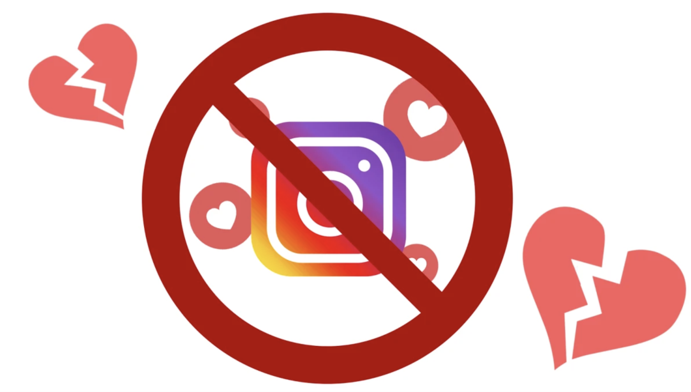
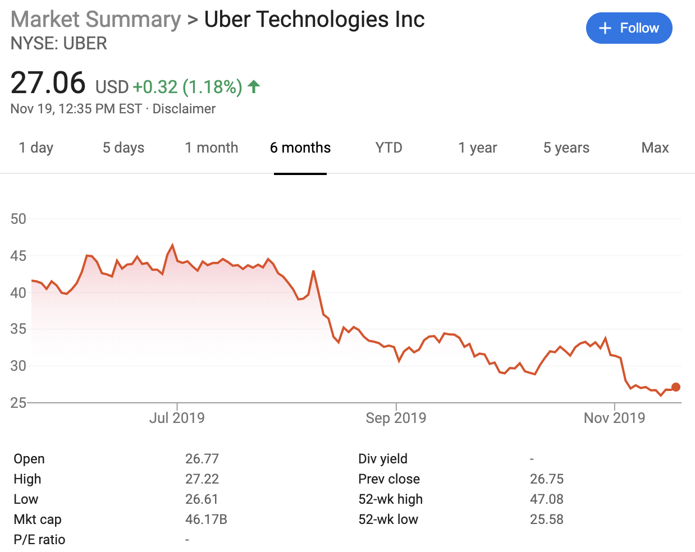

We deliver a collection of timely, relevant, and curious topics across a broad landscape of interests. Join us, give us your feedback and sign up for our free weekly newsletter designed to nurture, expand, and engage the diverse world of data science. 

[Email us to receive our slides from Predictive Analytics World](mailto:consultation_request@paradigmdata.io). The slides outline a framework to build an analytic mindset, including real-world examples from companies like Lyft and Citrix. Please [reach out](mailto:consultation_request@paradigmdata.io) to us with feedback or to meet with us for a free consultation about how we can help train your teams in data science. 

We've also published an ebook for getting started in RStudio, Git, and Github. Check it out[ here](https://leanpub.com/showingyourwork/).

* * *

## Tech >

### MacBook Pros will finally have a great keyboard again

I kept a late 2015 MacBook pro until it was on its last leg. Why? Because I didn't want to type for hours on the newer 'butterfly' keyboard. [But it looks like the MacBook has moved away from the notorious keyboard in 2019](https://www.wired.com/story/apple-macbook-pro-16-2019/?mbid=social_twitter&utm_brand=wired&utm_campaign=wired&utm_medium=social&utm_social-type=owned&utm_source=twitter).

The 'butterfly' keyboard was a significant shift in design, and it wasn't taken very well by MacBook users. In fact, this was such an issue that there's even a [lawsuit pending](https://www.classlawgroup.com/apple-macbook-pro-keyboard-defect-lawsuit/#the-form). This mob wasn't whipped up over pure design aesthetics, either. The problem with the butterfly keyboard is how easily debris (crumbs usually) can get under the keys and make it difficult to type. 

source: [https://giphy.com/gifs/frustrated-keyboard-g8GfH3i5F0hby](https://giphy.com/gifs/frustrated-keyboard-g8GfH3i5F0hby) 

The previous design used the [scissor-switch design](https://en.wikipedia.org/wiki/Keyboard_technology#Scissor-switch_keyboard) and had a 2mm travel distance — this design choice made for a pleasant 'click' when the keys were depressed. The [butterfly design](https://www.macrumors.com/guide/butterfly-keyboard-issues/) reduced the travel distance (because the entire machine was thinner), but also resulted in sticky keys, dead keys, and (most importantly) a very different sound when depressed. 

The new laptop also has a robust set of speakers and an incredible 11 hours of battery life. It sounds like it might be time to upgrade. 

*"Call out quotes (“ "). These are indendented 0.5 an inch. Average Sans, size 13.”*

* * *

## Health & Medicine >

### Snake Oil and quackery during cold season

It's almost Thanksgiving, and that means flu season. There are all kinds of [medically established](https://www.nia.nih.gov/health/all-about-flu-and-how-prevent-it#prevented), [evidenced-based](https://www.cdc.gov/flu/prevent/actions-prevent-flu.htm) ways to reduce the risk of getting the flu, most importantly a flu shot. Unfortunately, this season also means a lot of pseudoscience and fake "miracle cures" for the flu. 

One of these products was [mentioned on Science Based Medicine](https://sciencebasedmedicine.org/zapping-a-cold-with-copper/), a blog where skeptics, scientists, and physicians write about the intersection of medicine, science, and society. Steven Novella, a Yale Neurologist, gives and even balanced review of the CopperZap, a "nasal wand" for preventing the common cold. How does it work? Check out the excerpt from their website,

*"Colds generally occur after cold viruses incubate for a time in the inner cavity of the nostril. During the incubation period, some people begin to feel a tickle in their nose that feels different from allergies and warns that a cold is about to start. It makes logical sense that applying solid copper, which is known to kill viruses, should beat back the cold virus and allow the immune system to quickly gain the upper hand."*

There is a lot of truth in this paragraph. Virsues do actually incubate in the mucus membranes in your nostrils. Copper and other alloys are known to kill viruses and bacteria. But connecting these two bits of information isn't as logical as CopperZap claims. 

First, do we know that the bacteria or viruses located in the nose are the only ones causing the cold? And can we say how long the copper would have to come into contact with the bacteria or viruses before they are killed? These are all the questions we might be able to answer if there was a clinical trial, but CopperZap hasn't done that trial. It's easier to sell a product that *sounds like it could work* than testing if a product actually works. 

CopperZap isn't cheap, either. At $69.95 plut tax and shipping, you might be better off getting a vaccine and covering your mouth and nose.

* * *

## Culture & Society >

### Instagram is hiding the number of likes 

     

source: [https://techcrunch.com/2019/11/14/instagram-private-like-counts/](https://techcrunch.com/2019/11/14/instagram-private-like-counts/)

Adam Mosseri, head of Instagram, [tweeted that](https://twitter.com/mosseri/status/1195101452399562752?s=20) the company would be making changes to the way likes get displayed on their app. In an interview at [WIRED25](https://xp.wired.com/?_ga=2.40656674.1050769308.1573494570-1681689359.1553109960) earlier this month, Mosseri stated that users would be able to have 'private likes.' The goal of this change is to remove some of the [social pressures](https://www.ncbi.nlm.nih.gov/pubmed/28263682) for young people, but Mosseri was quick to point out there was no clear link between using the application and adverse mental well-being. 

Businesses using Instagram want some way of quantifying 'likes' and views, because of how much clicking 'like' matters for business. Content with more likes is more likely to be seen (and liked, because likes lead to more likes). You can [even purchase likes](https://www.sciencedirect.com/science/article/pii/S0747563217300493). 

The science is emerging on how [bad Instagram is for meaningful social interaction](https://www.ncbi.nlm.nih.gov/pubmed/27855266). Hiding 'likes' seems like a first step in the right direction for Instagram. However, Instagram's business model still encourages users to generate content, and they've designed an application to prey on our time and attention. 

When asked the existential question,* "are you good for people?" *Mosseri responded that instagram is hoping to "*identify acute problems and address them." *He included removing hate speech off a platform here. Then he mentioned *"issues where you can lead and innovate," *and spoke about how Instagram is focusing on bullying. 

*"The idea is to try and depressurize instagram, make it less of a competition, give people more space."*

We will wait until the data are in to see if there’s any change in how users engage with the app.

* * *

## Money >

### Uber purge

Uber, the ride-sharing innovator and tech-bro incubator, went public in May of this year. Since then, the company's stock has declined about 38%. Travis Kalanick, the former CEO, [recently dumped another $171](https://markets.businessinsider.com/news/stocks/travis-kalanick-sells-another-171-million-of-uber-stock-2019-11-1028701056) million worth of stock over the weekend. The recent sale means Kalanick has [sold 33 million shares](https://www.cnbc.com/2019/11/19/uber-ex-ceo-travis-kalanick-has-sold-almost-900-million-in-stock.html) (for almost 1 billion dollars). 

Ride sharing companies have had some rough times lately. In September, both [Uber](https://www.cnbc.com/2019/08/08/uber-earnings-q2-2019.html) and [Lyft](https://investor.lyft.com/news-releases/news-release-details/lyft-announces-record-second-quarter-results) reported losses. California is trying to [pass a law](https://www.sacbee.com/opinion/article234624897.html) that would change the status of Uber drivers from contractors to employees, which could be catastrophic. 

Ride sharing has been an interesting experiment since it's launch, but it still isn't clear how profitable it is (for the driver or the company). However, we do know [Uber Elevate](https://www.uber.com/elevate.pdf/) is a thing, and we've all been forced to learn about economic concepts like [elasticity of demand](https://www.investopedia.com/ask/answers/012915/what-difference-between-inelasticity-and-elasticity-demand.asp) and [surge pricing](https://www.investopedia.com/articles/personal-finance/021015/uber-versus-yellow-cabs-new-york-city.asp). 

[Farhad Manjoo wrote a NYT blog post](https://bits.blogs.nytimes.com/2014/08/28/uber-and-lyft-have-become-indistinguishable-commodities/) in 2014 that claimed ride have "*become commodities*." There is no real difference between the service these two companies offer: a ride is a ride. We're curious where this all will lead in the next 10 years. 

*"It’s difficult to see how either Uber or Lyft can rise above commodification. They are both constantly trying out new services, but if either hits on something successful, the other could easily copy it."*

* * *

## R-roundup sections > 

### [Tabyls are great](https://cran.r-project.org/web/packages/janitor/vignettes/tabyls.html)

* We’ve been using a lot of these lately--great for counting things. 

source:[https://cran.r-project.org/web/packages/janitor/vignettes/tabyls.html](https://cran.r-project.org/web/packages/janitor/vignettes/tabyls.html)

*[Working with model outputs* ](https://resources.rstudio.com/rstudio-conf-2019/solving-the-model-representation-problem-with-broom?utm_content=buffer1456f&utm_medium=social&utm_source=twitter&utm_campaign=buffer)

* Model outputs are tricky if you’re learning the tidyverse. Alex Hayes has a great presentation here on using broom to manage this workflow ([slides](https://github.com/alexpghayes/workshops_presentations/blob/master/2019-01-18-rstudioconf-broom-talk.pdf))

*[Dash dashboards from Plotl*y](https://dash.plot.ly/)

* Plotly has a great package for deploying dashboards with Python or R code. Check out the [Github repo](https://github.com/plotly/dash-sample-apps). 

* * *

Follow us:

[@datasartoriasf](https://twitter.com/datasartoriasf)

[@mjfrigaard ](https://twitter.com/mjfrigaard)

[Peter Spangler](https://www.storybench.org/author/spangler/)

[Martin Frigaard](http://www.storybench.org/author/martinfri/)

[Paradigm Data Group](https://www.paradigmdata.io/)

