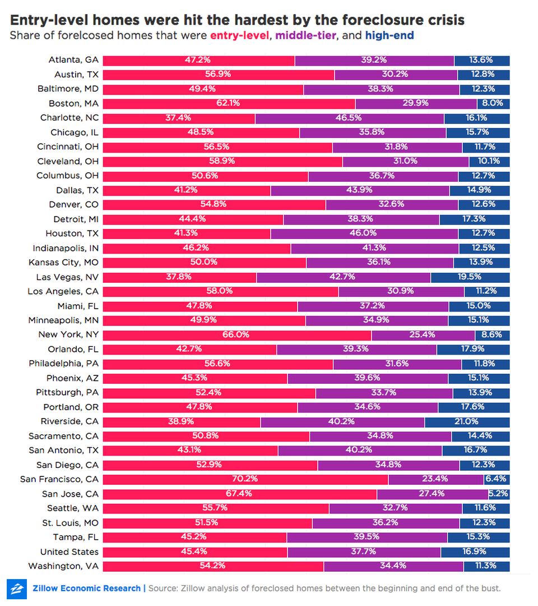
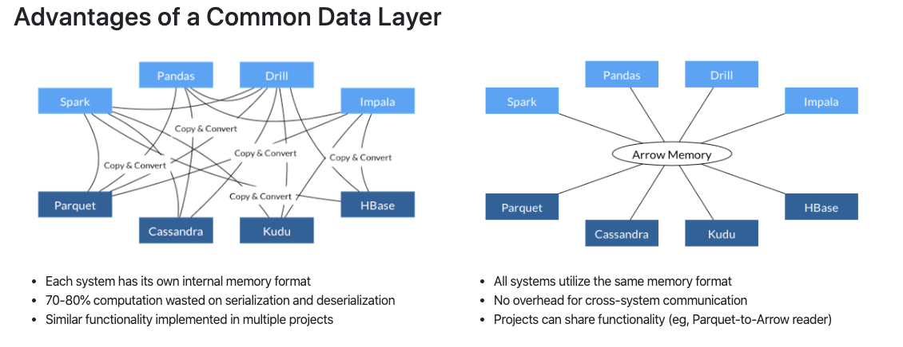
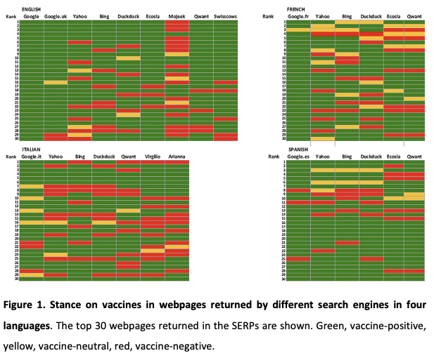
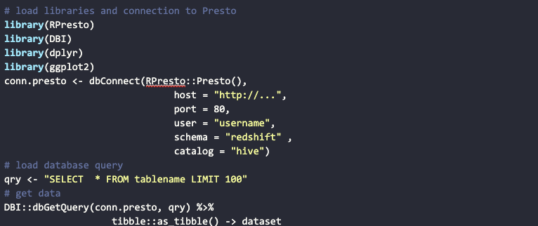
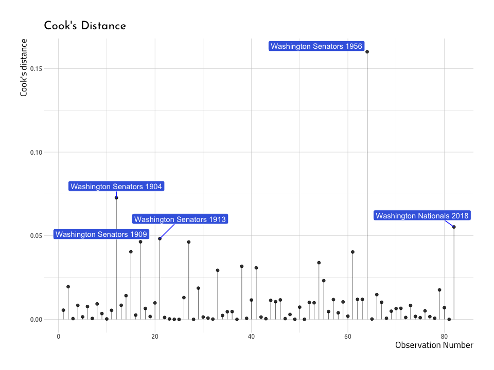

We deliver a collection of timely, relevant, and curious topics across a broad landscape of interests. Join us, give us your feedback and sign up for our free weekly newsletter designed to nurture, expand, and engage the diverse world of data science. 

 [Email us to receive our slides from Predictive Analytics World](mailto:consultation_request@paradigmdata.io). The slides outline a framework to build an analytic mindset, including real-world examples from companies like Lyft and Citrix. Please [reach out](mailto:consultation_request@paradigmdata.io) to us with feedback or to meet with us for a free consultation about how we can help train your teams in data science. 

We've also published an ebook for getting started in RStudio, Git, and Github. Check it out[ here](https://leanpub.com/showingyourwork/). Check out the Github repo for the past newsletters [here](https://github.com/mjfrigaard/pdg-newsletters). 

* * *

## Tech >

### Machine Learning at Google

[https://www.youtube.com/watch?v=k_jnj8e7VPE&feature=youtu.be](https://www.youtube.com/watch?v=k_jnj8e7VPE&feature=youtu.be)

[Valentine Fontama](https://www.linkedin.com/in/valentinefontama/) is the Global Lead for Google’s AI and Machine Learning Practice team. In this panel discussion he and experts from Hewlett Packard and HSBC address the implications for humans in the growing practice of AI. The panelists share real world examples including the area of human judgement in prediction. At time 30:14 in the video, panelists share a use case of diagnosing tuberculosis where a human must validate the AI predictions and how operationalizing these models can be a challenge. 

source: [What’s left for the human after AI & robotics?](https://www.youtube.com/watch?v=k_jnj8e7VPE&feature=youtu.be) 

* * *

If you like what you read, how about clicking the ❤️ up top. We’ll be very grateful.* * *

## Health & Medicine >

# *Wealth has an uneven impact on obesity among men and women *

Analysis of longitudinal data by the [National Institutes of Health](https://www.nih.gov/) showed that obesity among middle-aged  men was not related to net worth. This net worth-obesity association was statistically significant for women such that greater net worth was associated with a lower risk of obesity. The main driver of net worth was home value. Despite the growing trend of [single female home ownership](https://www.lendingtree.com/home/mortgage/homeownership-gender-gap-study/) outpacing single men, women may have been more severely impacted by the foreclosure crisis because entry level homes were impacted the most.

*Of all the homes foreclosed upon nationwide between January 2007 and December 2015,**[[2*]](https://www.zillow.com/research/housing-bust-wealth-gap-21543/#_ftn2)* 45.4 *

*percent were in the bottom third of all homes in terms of value, compared with just 16.9 percent that were high-end.*

Foreclosures and the loss of value from the peak of the market could have impacted women more broadly simply by the fact that they are more likely to be single homeowners compared with single men. The study of 6,979 respondents did not break out the impact of wealth on obesity by single versus married but the economic events can pose their own independent effects based upon where men and women had invested.

source: [Wealth and Obesity Among US Adults Entering Midlife](https://onlinelibrary.wiley.com/doi/abs/10.1002/oby.22625) 

* * *

## Science >

### Language agnostic columnar data storage 

Wes McKinney (of [Pandas](https://pandas.pydata.org/) fame) has been the Director of [Ursa labs](https://ursalabs.org/about/) since 2018 and has been [giving talks](https://www.youtube.com/watch?v=dSY8OxBNqDw) about all the neat technological problems they are hoping to tackle. The first, Apache Arrow, is a "cross-language development platform for in-memory data." That description should give you goosebumps from the anticipation ("oh--what the world could be!") because of how much time gets wasted in data science converting data from one format to another. 

For example, if your company stores data in a SQL database, then extract these data into another application (Excel, Python, R, Tableau, etc.), there is a problem of moving the data from one program to another. The Apache Arrow project hopes to make this problem a thing of the past by becoming a "unifying, high-performance data interoperability layer beyond the data science world."

Sharing a common data layer--where in-memory data is consistent across projects--enables everyone to share data across different programming environments. McKinney has a great quote on how to think about programming languages,

*"programming languages are really user interfaces for describing computations, so there need not be a tight coupling between the lines of Python or R code that you write, and the way that gets translated into an algorithmic description of data manipulations."*

Hadley Wickham (of [dplyr](https://dplyr.tidyverse.org/) and [tidyverse](https://www.tidyverse.org/) fame) from RStudio is the only listed advisor on Ursa labs, which should also get you excited about this project. Wickham and McKinney are famous for their ability to tackle problems of this scale (importing and sharing data is a problem everyone in data science has to deal with). It's inspiring to see two leaders from different analytic programming languages working together, in the open, and sharing it with everyone.  

source: [https://ursalabs.org/tech/#serialization-formats-and-data-access](https://ursalabs.org/tech/#serialization-formats-and-data-access)

## * * *

## Media & Politics >

### Trade-offs between privacy and scientific validity

Researchers from Brighton & Sussex Medical School in Brighton, United Kingdom, investigated the relationship between search Internet engines (like Google) approach to privacy and the quality of the scientific information they return.

How would you test something like this? Well, the researchers in the UK decided to enter the search term "vaccines autism" in multiple search engines. They varied the searches by conventional search engines (Google, Bing, and Yahoo) vs. search engine's emphasizing the protection of searchers' privacy (Duckduckgo, Mojeek, Qwant, and Ecosia3). They also performed searches in multiple languages (English-UK, Italian, Spanish, and French).

They scored the search results on a scale from "vaccine-positive," "vaccine-neutral, "vaccine-negative." The authors then used Cohen's Kappa to check the inter-rater reliability (example and R package to perform this [here](http://www.cookbook-r.com/Statistical_analysis/Inter-rater_reliability/)) and then corrected for multiple comparisons using [Fisher's two-tailed test.](https://rdrr.io/cran/RVAideMemoire/man/fisher.multcomp.html) 

They discovered the search engines who emphasized privacy returned the least scientifically valid information, while Google stood out as providing evidence-based medical information on vaccinations consistently. These findings are alarming because it shows that there isn't an alternative search engine that users can adopt if they don't wish to share their information with Google. More importantly, we don't currently have mechanisms in place to evaluate the role search engines play in providing public health information. The authors describe the current situation in the car analogy below,

*"Designing a search engine that is privacy savvy and avoids issues with filter bubbles that can result from user-tracking may be a good thing, like designing a car with an engine that does not pollute and is inexpensive to run...However, if the brakes in an environmentally-designed car do not work, the car is unsafe and this negates the positive ethical decisions made by the designers. In a car this is a highly unlikely design outcome, as a car has to undergo several rounds of testing by regulatory agencies before being allowed on the market."*

We do not have the regulatory testing or quality control standards for search engines, despite how quickly they can spread misinformation, and how potentially damaging that information can be.

source: [https://128.84.21.199/abs/1912.00898](https://128.84.21.199/abs/1912.00898)

* * *

## Money >

### Transparency is a gap in online lending

[Financial literacy](https://www.prosperous.finance/about-us) is a hot topic with the challenges faced by millennials and startups alike. Recent research by the Federal Reserve demonstrates an absence of transparency for small businesses searching for credit among online lenders. This frustration is represented in the quantitative measures of satisfaction in the marketplace. Net satisfaction among online lenders was only 33% compared with 73% at small banks and 55% at large banks. A shopping simulation study where small businesses searched for lending solutions resulted in complaints of unfamiliar terminology and a general absence of important details including rates, fees and repayment information. This non-traditional language obfuscated the actual cost of loan products such that they could not be compared to their peers in the marketplace. The proprietary language used by online lenders is unfounded in banking and prevented the majority of study participants from correctly identifying the least expensive option. Mortgages and credit cards use the APR as a standard measure of cost for the borrower. For example, among three online lenders the APR for 6 month $50,000 loan ranged from 46% to 70% APR. The [Board of Governors of the Federal Reserve System](https://www.federalreserve.gov/publications/consumer-community-context.htm) produces a monthly newsletter to help consumers understand financial products. 

Source: [Consumer and Community Context, November 2019](https://www.federalreserve.gov/publications/files/consumer-community-context-201911.pdf)

* * *

## R-roundup >

#### Querying databases in RStudio

* Thanks to [Julia Silge](https://twitter.com/juliasilge) for sharing this tweet by [Jim Hester](https://twitter.com/jimhester_) on interacting with databases within RStudio. Querying data within RStudio gives flexibility, especially when using a tool like [Mode Analytics](https://mode.com/) that and include many database connections such as Presto and Redshift. Below is a typical setup for connecting to Presto from within RStudio. 

<table>
  <tr>
    <td># load libraries and connection to Presto
library(RPresto)
library(DBI)
library(dplyr)
library(ggplot2)
conn.presto <- dbConnect(RPresto::Presto(), 
                              host = "http://...", 
                              port = 80, 
                              user = "username", 
                              schema = "redshift" , 
                              catalog = "hive")
# load database query
qry <- "SELECT  * FROM tablename LIMIT 100" 
# get data
DBI::dbGetQuery(conn.presto, qry) %>% 
                   tibble::as_tibble() -> dataset</td>
  </tr>
</table>

**Source: ****[Setup a database connection in RStudi**o](https://www.tidyverse.org/blog/2019/12/odbc-1-2-0/)

* * *

If you like what you read, how about clicking the ❤️ up top. We’ll be very grateful.* * *

#### Diagnosing the accuracy of your linear regression in R

* [Martin Frigaard](https://twitter.com/mjfrigaard) shares a step-by-step guide to building your linear regression model in R. Excellent visualizations and code included.

source: [Diagnosing the accuracy of your linear regression in R](https://www.storybench.org/diagnosing-the-accuracy-of-your-linear-regression-in-r/)

### Search for the package you need with [pkgsearch](https://r-hub.github.io/pkgsearch/)

* This new package allows users to search for packages based on topic, explore the most downloaded packages, and packages that are trending.

source: [https://r-hub.github.io/pkgsearch/](https://r-hub.github.io/pkgsearch/) 

Follow us

[@datasartoriasf](https://twitter.com/datasartoriasf)

[@mjfrigaard ](https://twitter.com/mjfrigaard)

[Peter Spangler](https://www.storybench.org/author/spangler/)

[Martin Frigaard](http://www.storybench.org/author/martinfri/)

[Paradigm Data Group](https://www.paradigmdata.io/)

