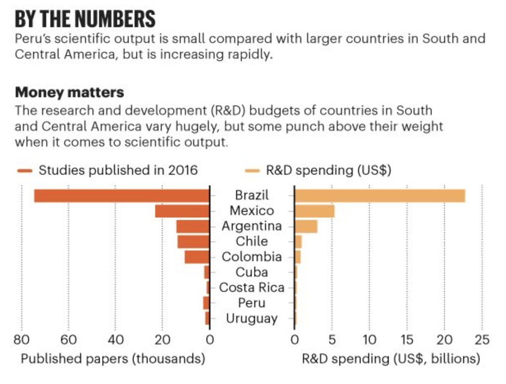

Happy Holidays! We hope you’ve had a great week and that you’ve planned a relaxing, fun-filled vacation with family and friends. We wanted to address a few house cleaning items going into the New Year:

* We will be delivering R/RStudio workshops with Jumping Rivers next month, check the website here 

* The Paradigm will now be coming out every Saturday (so as not to clutter your already full email inboxes with yet another email). You can expect the next edition on 

* Our website is currently under construction, so please direct any questions about the upcoming January workshops with Jumping Rivers to Martin directly

The Paradigm is a collection of timely and relevant topics across a broad landscape of interests. We cover technology, science, health & medicine, politics & culture, media, and sports. A common thread connecting all our content is the methods and data people are using to discover insights, build visualizations, make better decisions, or just understand the world better. Please subscribe and give us your feedback!

Our free resources:

* Email us to receive our slides from Predictive Analytics World. The slides outline a framework to build an analytic mindset, including real-world examples from companies like Lyft and Citrix. 

* We also published an ebook for getting started in RStudio, Git, and Github. Check it out[ here](https://leanpub.com/showingyourwork/).

Please reach out to us with feedback or to meet with us for a free consultation about how we can help train your teams in data science. 

* * *

## Tech

### One’s one man's rubbish may be another's...actual rubbish

Amazon is selling garbage. Not low-quality items that you probably shouldn't buy-- we're talking actual trash. Ars Technica and the Wall Street Journal published reported on explaining how products purchased through the Amazon website might come from a dumpster.

The issue is captured well in the display of items on the Amazon website. The image below shows two categories of products: on the left are products sold by Amazon, from an Amazon facility; On the right are the products that come from Fulfilled By Amazon (or FBAs) businesses. FBA products aren't sold by Amazon, but rather by third-party sellers, which also means they had initially been shipped from a non-Amazon facility. 

People pay money to become an FBA, and FBA business operates by finding inexpensive items, buying these items (usually in bulk), then listing these products on the Amazon site at an adequate amount to make a profit. The big bonus for being an FBA is that the items are searchable through Amazon's website, and if they are purchased, they get shipped with the Prime Sticker. 

*"The Branding FBA products can receive can confuse customers...people started equating the Prime badge with Amazon."*

Third-party sellers aren't inherently wrong, because there are opportunities to find deals and make money if you're savvy about where to find them. However, there's an essential distinction between 'bargain hunters' and 'dumpster divers.' People put stuff in dumpsters because they are equating them with all other forms of garbage, so they are likely in physical contact with all the additional items that have met the same fate. 

The Wall Street Journal investigators pulled three Trader Joe's items out of a dumpster, cleaned them up, listed these items on Amazon as new, and then purchased these items to see how they'd show arrive.

Sure enough, two of the items showed up in Amazon packaging. The third item showed up in the same packaging, but with an Amazon shipping label. Amazon has updated its policies now to specify that things should not be from the garbage, and issued the following statement,

*"sourcing items from the trash has always been inconsistent with Amazon's high expectations of its sellers and prohibited by the Seller Code of Conduct on Amazon, which requires that sellers act fairly and honestly to ensure a safe buying and selling experience." *

source: [https://arstechnica.com/tech-policy/2019/12/some-junk-for-sale-on-amazon-is-very-literally-garbage-report-finds/](https://arstechnica.com/tech-policy/2019/12/some-junk-for-sale-on-amazon-is-very-literally-garbage-report-finds/?utm_brand=arstechnica&utm_source=twitter&utm_social-type=owned&utm_medium=social)

source: [https://www.wsj.com/articles/you-might-be-buying-trash-on-amazonliterally-11576599910](https://www.wsj.com/articles/you-might-be-buying-trash-on-amazonliterally-11576599910) 

* * *

## Sport & Performance

### The philosophy of top athletic performers

Alex Hutchinson wrote an excellent article in Outside on coaching philosophies. The research cited in the story discusses developing theories from French Philosopher [Michel Foucault.](https://en.wikipedia.org/wiki/Michel_Foucault) The original [research article](https://www.tandfonline.com/doi/abs/10.1080/21640629.2018.1487632) discusses alternative training methods used by various coaches of top performers. The article is an ‘N of 1" study using qualitative research methods on a sample size consisting of "one high-performance university cross- country running team consisting of one male head coach and 20 athletes (10 male and 10 female)." Hutchinson covers many of the critical bits, but we wanted to elaborate on a discussion point from the paper. 

One of the Foucaultian coaching strategies the study evaluated was the removal of 'maintaining temporal control,' or focusing too much on run times. There were some miscommunications between the researcher and the coach that brought about some interesting discussion points. The coach instructed the athletes to "remove their stopwatches for various repetitions on the track," but the coach continued to time the athletes. Unfortunately, this somewhat diminished the intention of removing the athletes watches, because time was still a constraint. The coach made the point that his employment was dependent on runners' race times, and while he could understand not having the athletes wear the watches, he couldn't see the benefit of him not having a watch. 



source: [https://photos.com/featured/hand-holding-stopwatch-csa-images.html?product=art-print](https://photos.com/featured/hand-holding-stopwatch-csa-images.html?product=art-print)

We thought this was a great example of [Goodhart's Law](https://en.wikipedia.org/wiki/Goodhart%27s_law), "*any observed statistical regularity will tend to collapse once pressure is placed upon it for control purposes*." 

This point is covered in depth in the book, "[The Tyranny of Measurement](https://www.amazon.com/Tyranny-Metrics-Jerry-Z-Muller/dp/0691174954)" by Jerry Z. Muller. Muller includes the increasing dependency on measurement and data as metric fixation and points out how many times there needs to be a distinction made between numbers and their meaning. 

*"Trying to force people to conform their work to preestablished numerical goals tends to stifle innovation and creativity—valuable qualities in most settings. And it almost inevitably leads to a valuation of short-term goals over long-term purposes."*

The track coach evaluates his performance on race times because that number will dictate how his athletes get ranked with competitors. However, one could say that the purpose of the watch is mostly for coaches and spectators to know who won when there is a close call. The athletes might need to focus on running as fast as they can for a given distance, irrespective of what time is on the clock. source: [https://www.outsideonline.com/2406804/foucault-endurance-coaching-study](https://www.outsideonline.com/2406804/foucault-endurance-coaching-study) 

### It's all in your mind ...well--the upper-left portion of your mind.

Researchers from the University of Kent (UK) were able to demonstrate that transcranial direct current stimulation over the left dorsolateral prefrontal cortex can improve performance for cycling athletes. This study involved twelve healthy cyclists and randomized them to either placebo or treatment experimental conditions. The twelve cyclists performed a variety of psychological and physiological tests throughout the two visits.

The psychological measurements included mood, pain, motivation (success and intrinsic), participant perception of effort (or rating of perceived exertion). The researchers measured physiological data, including heart rate, capillary blood lactate concentration, and electromyography activity in the leg muscles during the entire cycling test. 

The experimental procedure was the [Stroop Task](https://www.psytoolkit.org/experiment-library/stroop.html), which you can demo [here](https://www.psytoolkit.org/experiment-library/experiment_stroop.html). I did a quick trial of this test and stored the data in this [Jupyter Notebook](https://github.com/mjfrigaard/pdg-newsletters/blob/master/2019-12-23-newsletter/2019-12-23-stroop-experiment-data.ipynb). Researchers instructed participants to perform this task when they first showed up at the lab (t0), right after the transcranial direct current stimulation (t1), and following the cycling time-to-exhaustion test (t2). The graphic below shows the experimental procedures.

source: [Transcranial Direct Current Stimulation over the Left Dorsolateral Prefrontal Cortex Improves Inhibitory Control and Endurance Performance in Healthy Individuals](https://www.ncbi.nlm.nih.gov/pubmed/31493549)

The two experimental groups were 1) transcranial direct current stimulation and 2) a sham group (identical to the actual transcranial direct current stimulation group, but stimulation only lasted for 30 seconds). The location of the electrodes and current readings are displayed below:

source: [Transcranial Direct Current Stimulation over the Left Dorsolateral Prefrontal Cortex Improves Inhibitory Control and Endurance Performance in Healthy Individuals](https://www.ncbi.nlm.nih.gov/pubmed/31493549)

The results showed that participants in the transcranial direct current stimulation group had a longer time to exhaustion, lower heart rates, and lower rates of perceived exertion. This finding is in line with Marcoa’s [earlier work](https://www.ncbi.nlm.nih.gov/pubmed/28044281) on mental fatigue and physical performance. 

If these findings are interesting to you, be sure to check out Alex Hutchinson’s book, [Endure: Mind, Body, and the Curiously Elastic Limits of Human Performance](https://www.amazon.com/gp/product/0062499866/ref=dbs_a_def_rwt_bibl_vppi_i0) or read his articles in [Outside](https://www.outsideonline.com/1745511/alex-hutchinson). 

source: [https://www.sciencedirect.com/science/article/pii/S0306452219306347](https://www.sciencedirect.com/science/article/pii/S0306452219306347) 

* * *

## Science & Politics

### Peru’s struggling scientific community 

Our friend and colleague wrote a worrisome piece [in Nature](https://www.nature.com/articles/d41586-019-03844-2) on Peru’s struggling scientific funding. The country has been reliant on international collaboration for scientific research, which makes it difficult for Peruvian researchers to lead scientific initiatives. Unfortunately, the Peruvian government doesn’t invest much in scientific discoveries (see image below). 

However, the problem might be more extensive than merely a lack of government funding. [Gisella Orjeda](https://www.linkedin.com/in/gisellaorjeda/?originalSubdomain=pe)--former president of Peru’s National Council of Science, Technology and Technological Innovation--feels the issue lies with the country’s education system.

*"We have lousy university education," she explains. "Peruvian policymakers don’t understand the role of universities — it is not to train professionals. The fundamental role of a university is to be a producer of knowledge, to teach students a way of thinking."*

Researchers in Peru also need to make sure their scientific discoveries get the appropriate levels of media and political attention. For example, a [recent study](https://www.nature.com/articles/s41586-019-1171-x) about the rates of obesity in rural areas got the researchers a meeting with a government agency. Hopefully, the future holds more connections between Peruvian researchers, the topics they investigate, and how scientific findings can lead to improvements for everyone. 

*source: **[https://www.nature.com/articles/d41586-019-03844-*2](https://www.nature.com/articles/d41586-019-03844-2) 

### Open science is the only kind of science 

Open science is not something we have to think about very much in western democracy, but we should. In a paper titled, "[Open science: human emancipation or bureaucratic serfdom](https://archiviomarini.sp.unipi.it/858/7/Openscience.pdf)?" author Maria Chiara Pievatolo interrogates this question at length and gives us a great crash course in Philosophy of Science. 

**Some background:** In Italy, the Agenzia Nazionale di Valutazione del Sistema Universitario e della Ricerca ([ANVUR](https://en.wikipedia.org/wiki/ANVUR)) was formed in 2006 to bring academic research under "a centralized administrative control." Pievatolo argues research under ANVUR is equivalent to reducing science into a “bureaucratic, commodified enterprise." Under ANVUR, science is open to manipulation by political and business ends. Open science, Pievatolo states, should be mandated and protected because as it stands, science in Italy can’t be considered “open.”

*"The backwardness of research assessment in Italy -- centralized, controlled by the government, enchained to rigid quantitative parameters -- is an extreme instance of the administrative authoritarianism that is stiffening, globally, an activity for whose freedom the natural philosophers of the early modern age had to fight."*

She also discusses some important points about censorship and freedom of thought more generally, in particular for commitments to belief systems. 

*"A system of beliefs - or even an ethos - whose justification depends on its partakers’ free choice cannot be codified in a coercive norm without cutting the root of its very legitimacy. If its established doctrine deserves to be accepted because it has been freely discussed and chosen by a community, it should be possible to keep on debating and choosing it not only yesterday or the day before yesterday, but also today and tomorrow."*

I found this reading fascinating and apt for the times we’re living in. We're living in times of rapid change, and it can be hard to stay up on everything. The quote above reminds me that each generation should have the right to define what they value, what they prioritize, and what parts of the previous generation to take into the future. Science is one of the few human endeavors that can produce artifacts demonstrating it's importance. While we might debate the merits of modern medicine, the internet, advanced weapons systems, we rarely question the necessity of discovery. 

Science is a method, a way of examining and evaluating the world we live in to understand it better. As 2019 comes to an end, I am grateful that we've seen science extend into more and more fields and disciplines, and that we've started demanding evidence for the claims we hear. This gives me hope.

source: [https://archiviomarini.sp.unipi.it/858/7/Openscience.pdf](https://archiviomarini.sp.unipi.it/858/7/Openscience.pdf)

* * *

## R-roundup sections > 

* [Statistical Rethinking (2nd Edition)](https://www.crcpress.com/Statistical-Rethinking-A-Bayesian-Course-with-Examples-in-R-and-STAN/McElreath/p/book/9780367139919): An exciting new edition to a great book. Check out the videos [here](https://www.youtube.com/channel/UCNJK6_DZvcMqNSzQdEkzvzA/playlists).  

* *[R and Python, a love stor*y](https://rstudio.com/solutions/r-and-python/)[.](https://rstudio.com/solutions/r-and-python/) Great video here on using Python with RStudio. 

* *[Tidyexplai*n](https://github.com/gadenbuie/tidyexplain). Watch how tidyverse verbs work. 

* *[What they forgot to teach you about *R](https://rstats.wtf/) by Jenny Byan and Jim Hester

* * *

Follow us:

[@datasartoriasf](https://twitter.com/datasartoriasf)

[@mjfrigaard ](https://twitter.com/mjfrigaard)

[Peter Spangler](https://www.storybench.org/author/spangler/)

[Martin Frigaard](http://www.storybench.org/author/martinfri/)

[Paradigm Data Group](https://www.paradigmdata.io/)

